<!-- @import "[TOC]" {cmd="toc" depthFrom=1 depthTo=6 orderedList=false} -->

<!-- code_chunk_output -->

- [组会](#组会)
  - [12.19 组会](#1219-组会)
  - [12.26 组会](#1226-组会)
- [VoteNet](#votenet)
  - [数据集](#数据集)

<!-- /code_chunk_output -->

# 组会

## 12.19 组会

__1. 体素地图美化__

体素大小 0.05x0.05x0.05m。
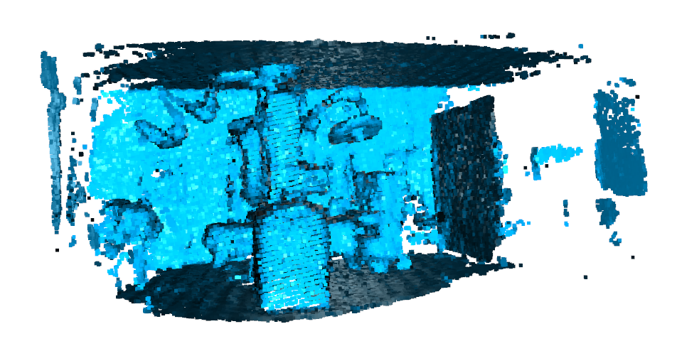

__2. RANSAC 方法点云粗配准__

http://www.open3d.org/docs/release/

==前提假设：VoteNet 已经估计出了“大致准确”的台车 b-box。换句话说，已知“大致准确”的台车位姿。接下来分两步优化台车位姿：RANSAC 粗调；ICP 精调。==

* source model:
b-box 内部点云 -> 剔除具有自由度的点云
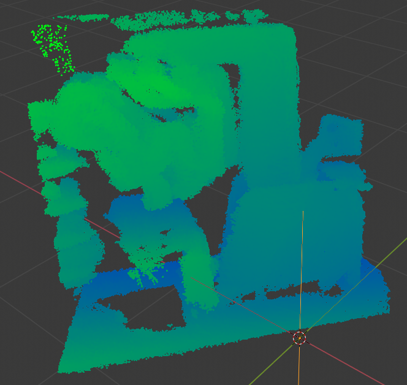 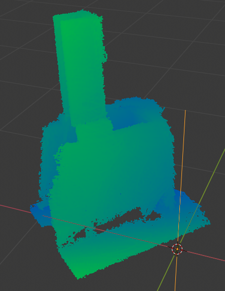
剔除台车大立柱以上部分和控制面板。使用五个面（底座的四个侧面 + 地面）进行点云配准。

* target model:
SOLIDWORKS(.stl) -> blender(.obj) -> pcl(.ply)
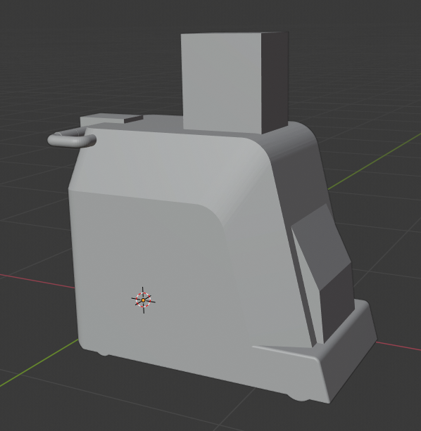 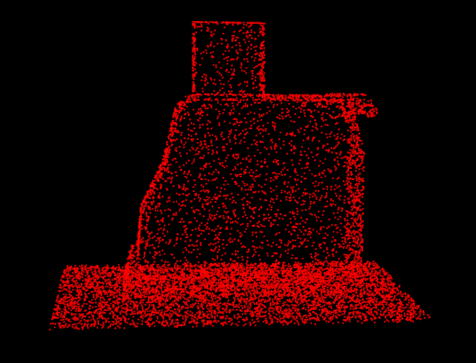
在原始模型的基础上增加地面信息。

* 初值
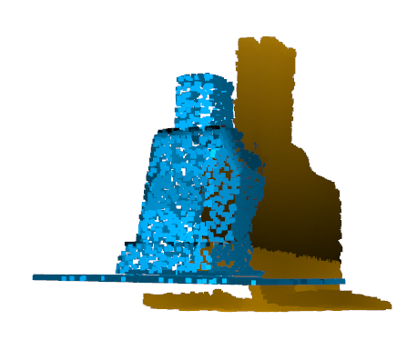

* 预处理
    * 点云降采样   
    * 估计点云法向量
    * 计算点云 FPFH 特征（描述邻域几何特征的 33 维向量）。_Fast Point Feature Histograms (FPFH) for 3D registration, ICRA, 2009._

* RANSAC
    * 每次迭代，在 source model 里随机选择 n 个点。
    * 在 target model 中找到对应的 FPFH 特征最相似点。
    * 筛除误匹配点对：匹配点对 transform 后的空间距离应相近；匹配线段的长度应相近。
    * 使用正确匹配的点对计算 T 矩阵。

* 粗匹配结果
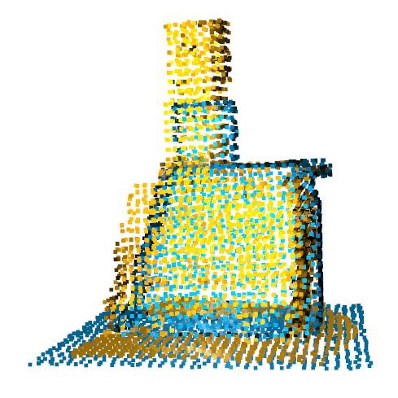

__3. ICP 方法点云精配准__

* Point-to-plane ICP
    _Object modelling by registration of multiple range images, Image and Vision Computing, 1992._
    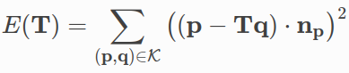
    * 基于当前迭代的 T，查找匹配点对 $\mathcal{K}$：$\mathbf{p} \in Target, \mathbf{q} \in Source$。
    * 基于优化方程的雅可比矩阵，更新 T。

* 精匹配结果：
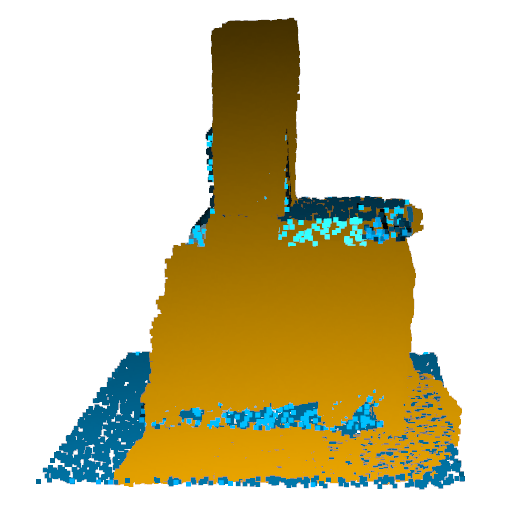

## 12.26 组会

# VoteNet

## 数据集

==原文验证过两个数据集：==
__SUN RGB-D:__ rgb-d 相机拍照，手动标注 b-box。每张图片的点云数量约 20K。
__ScanNet:__ rgb-d 相机拍视频，多帧融合生成场景，手动标注 semantic-label。每个场景的点云数量约 40K。

==任务：==
仿照 ScanNet，每组场景生成四张不同视角的虚拟深度图，再从深度图构建点云，并对四片点云进行拼接，合成一整片场景点云，作为最终的虚拟数据集。

==参考项目：==
__Segmenting Unknown 3D Objects from Real Depth Images using Mask R-CNN Trained on Synthetic Data__
The International Conference on Robotics and Automation (ICRA 2019)
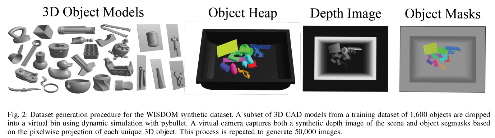
提出了一种生成虚拟点云数据集的方法。
实验表明，虚拟训练集训练出的网络在测试集上的表现，可以媲美真实训练集。

==识别目标：==
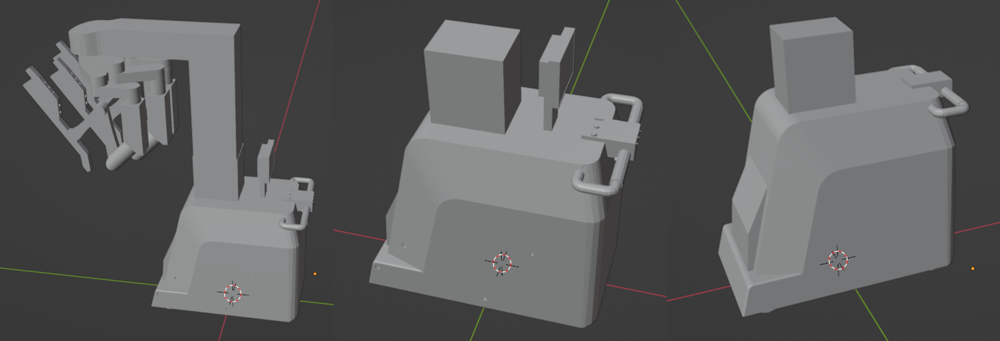
为了让网络更加鲁棒，由精细到粗糙生成了 3 个手术台车的模型，简记为 cart。

==手术室虚拟环境：==
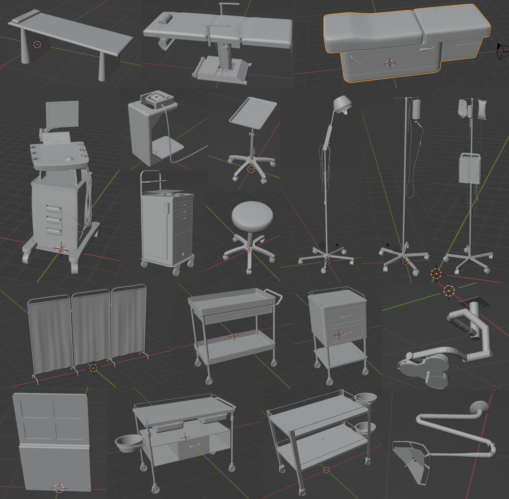
https://www.cadnav.com/3d-models/
搜集了 19 个手术室设备的模型，作为虚拟环境，简记为 envs。

==策略：==
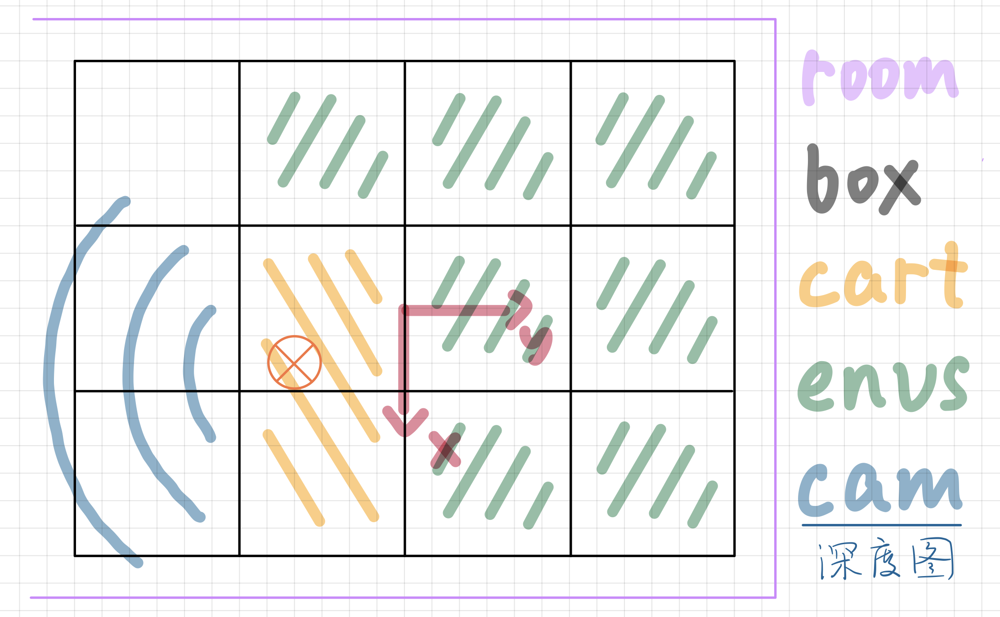
1. 将 7mx9m 的 room 分割为 12 个 尺寸为 2mx2m 的 box。
2. 从左往右第二列的随机两个相邻 box 内，会生成一个 cart；第二列的剩余一个 box 和第三四列的六个 box 会各自随机生成一个 envs。
3. 相机随机在第一列的多个视角拍摄 cart，生成深度图。
4. 设置高度会变的天花板，防止网络从天花板高度预测台车高度。

==输出：==

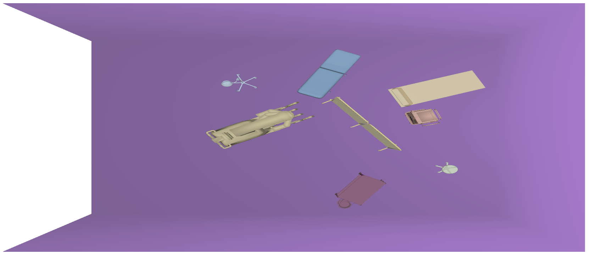
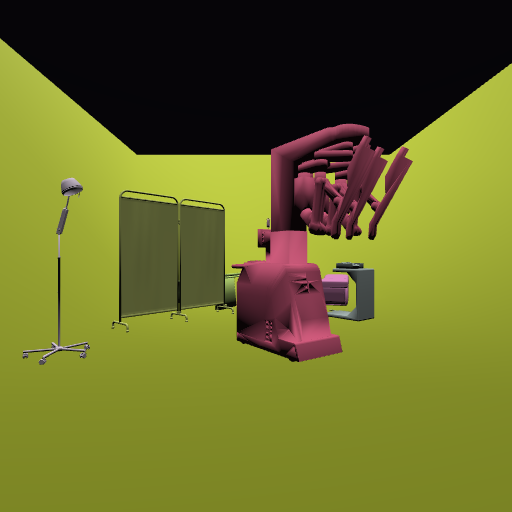

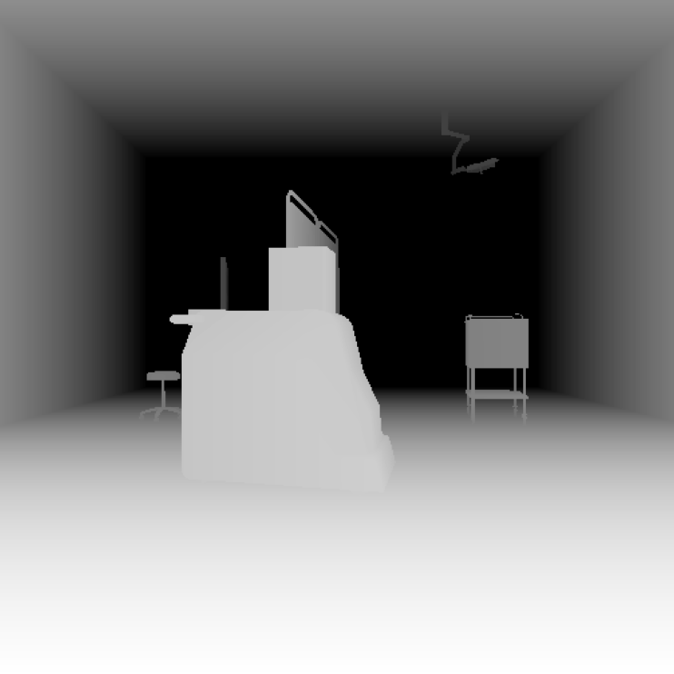

b-box 尺寸固定：1350(L)x760(W)x1500(H)

