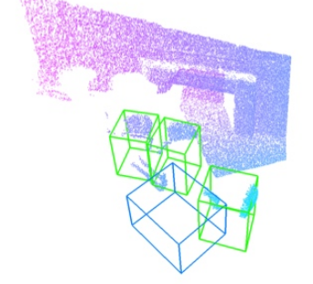

# 组会

## 12.19 组会

__1. 体素地图美化__

体素大小 0.05x0.05x0.05m。

__2. RANSAC 方法寻找迭代初值__

==前提假设：VoteNet 已经估计出了“大致准确”的台车 b-box。换句话说，已知“大致准确”的台车位姿。接下来分两步优化台车位姿：RANSAC 粗调；ICP 精调。==

* source model:
b-box 内部点云 -> 剔除具有自由度的点云
 

* target model:
SOLIDWORKS(.stl) -> blender(.obj) -> pcl(.ply)
 

* 初值

* 算法流程
We downsample the point cloud, estimate normals, then compute a FPFH feature for each point. The FPFH feature is a 33-dimensional vector that describes the local geometric property of a point. A nearest neighbor query in the 33-dimensinal space can return points with similar local geometric structures. 

* RAMSAC 原理

* 匹配结果

__3. ICP 方法 finetune 位姿__

* ICP 原理

* 精调结果：

__4. VoteNet__

# VoteNet 实战

