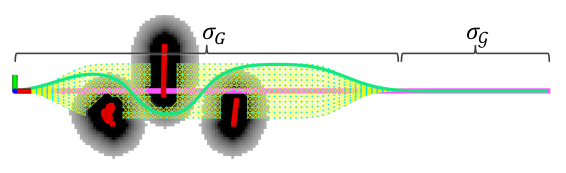
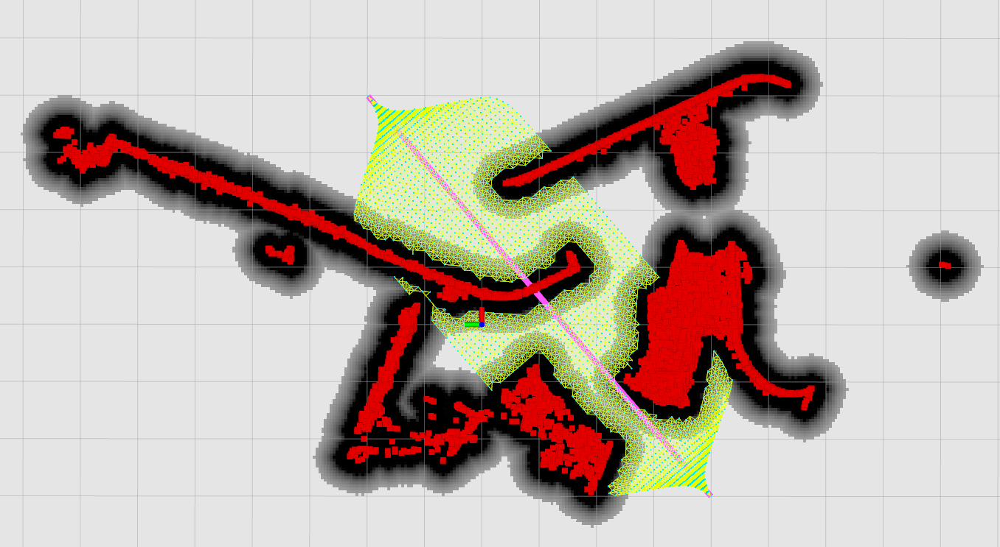

<!-- @import "[TOC]" {cmd="toc" depthFrom=1 depthTo=6 orderedList=false} -->

<!-- code_chunk_output -->

- [组会](#组会)
  - [12.19 组会](#1219-组会)
- [VoteNet](#votenet)
  - [数据集](#数据集)
  - [训练结果](#训练结果)
  - [后处理](#后处理)
- [路径规划](#路径规划)

<!-- /code_chunk_output -->

# 组会

## 12.19 组会

__1. 体素地图美化__

体素大小 0.05x0.05x0.05m。

# VoteNet

## 数据集

==原文使用的两个数据集：==
__SUN RGB-D:__ rgb-d 相机拍照，手动标注 b-box。每张图片的点云数量约 20K。
__ScanNet:__ rgb-d 相机拍视频，多帧融合生成场景，手动标注 semantic-label。每个场景的点云数量约 40K。

==任务：==
仿照 ScanNet，生成虚拟手术室场景，每组场景生成四张不同视角的虚拟深度图，再从深度图构建点云，并对四片点云进行拼接，合成一整片场景点云，作为一帧数据。最终生成 5k 帧数据，其中 4k 帧用于训练，1k 帧用于测试。

==参考项目：==
__Segmenting Unknown 3D Objects from Real Depth Images using Mask R-CNN Trained on Synthetic Data__
The International Conference on Robotics and Automation (ICRA 2019)

提出了一种生成虚拟点云数据集的方法。
实验表明，虚拟训练集训练出的网络在测试集上的表现，可以媲美真实训练集。

==识别目标：==

为了让网络更加鲁棒，由精细到粗糙生成了 3 个手术台车的模型，简记为 cart。

==手术室虚拟环境：==

https://www.cadnav.com/3d-models/
搜集了 19 个手术室设备的模型，作为虚拟环境，简记为 envs。

==策略：==

1. 将 7mx9m 的 room 分割为 12 个 尺寸为 2mx2m 的 box。
2. 从左往右第二列的随机两个相邻 box 内，会生成一个 cart；第二列的剩余一个 box 和第三四列的六个 box 会各自随机生成一个 envs。
3. 相机随机在第一列的多个视角拍摄 cart，生成深度图。
4. 设置高度会变的天花板，防止网络从天花板高度预测台车高度。

==输出：==

b-box 尺寸固定：1350(L)x760(W)x1500(H)

## 训练结果

__1. 获取地面平行于 x-y 面的地图__

一个 b-box 有 9 个参数（position 3, orientation 3, size 3）。
对于特定物体（比如台车），b-box 的 size 可以预先给定，不必训练。
VoteNet 只估计 4 个参数（position 3, orientation 1）。
也就是说输入 VoteNet 的地图必须平行于 x-y 面，==Vote-Net 只估计 b-box 绕 z 轴的 orientation==。

~~方法一：用 RANSAC 寻找平面，筛选平面确定地板，调整地图水平。~~

方法二：抓取前 0.1s 的 IMU 数据，取平均值作为重力方向，调整地图水平。

__2. 虚拟测试集的 loss__

主要关注 center loss 和 heading loss。

center loss 在 180 epoch 时降为约 0.0002m。

heading loss 在 180 epoch 时降为约 0.01deg（图中存在 1：15 的比例系数）。

__3. 真实场景的 loss__

网络实际是否可用，需要在真实数据集上进行验证。
使用 15 片真实扫描而来的点云进行验证。
使用 icp 点云配准结果作为 ground truth。

|场景号|center loss|heading loss|
|---|---|---|
|rii1|0.0514m|0.264deg|
|rii2|0.0503m|0.935deg|
|rii3|0.0196m|0.532deg|
|rii4|0.0425m|0.320deg|
|rii5|undetected||
|rii6|0.0322m|1.529deg|
|rii7|0.0549m|1.202deg|
|rii8|0.0316m|3.616deg|
|rii9|0.0372m|3.669deg|
|rii10|0.1140m|0.730deg|
|rii11|0.1094m|0.019deg|
|rii12|0.0390m|3.340deg|
|rii13|0.0431m|4.126deg|
|rii14|0.0391m|2.171deg|
|rii15|0.0482m|2.361deg|
|mean|0.0509m|1.772deg|

## 后处理

__1. RANSAC 方法点云粗配准__

http://www.open3d.org/docs/release/

==前提假设：VoteNet 已经估计出了“大致准确”的台车 b-box。换句话说，已知“大致准确”的台车位姿。接下来分两步优化台车位姿：RANSAC 粗调；ICP 精调。==

* source model:
b-box 内部点云 -> 剔除具有自由度的点云
 
剔除台车大立柱以上部分和控制面板。使用五个面（底座的四个侧面 + 地面）进行点云配准。

* target model:
SOLIDWORKS(.stl) -> blender(.obj) -> pcl(.ply)
 
在原始模型的基础上增加地面信息。

* 初值

* 预处理
    * 点云降采样   
    * 估计点云法向量
    * 计算点云 FPFH 特征（描述邻域几何特征的 33 维向量）。_Fast Point Feature Histograms (FPFH) for 3D registration, ICRA, 2009._

* RANSAC
    * 每次迭代，在 source model 里随机选择 n 个点。
    * 在 target model 中找到对应的 FPFH 特征最相似点。
    * 筛除误匹配点对：匹配点对 transform 后的空间距离应相近；匹配线段的长度应相近。
    * 使用正确匹配的点对计算 T 矩阵。

* 粗匹配结果

__2. ICP 方法点云精配准__

* Point-to-plane ICP
    _Object modelling by registration of multiple range images, Image and Vision Computing, 1992._
    
    * 基于当前迭代的 T，查找匹配点对 $\mathcal{K}$：$\mathbf{p} \in Target, \mathbf{q} \in Source$。
    * 基于优化方程的雅可比矩阵，更新 T。

* 精匹配结果：

# 路径规划

==参考论文：==

__A Receding Horizon Multi-Objective Planner for Autonomous Surface Vehicles in Urban Waterways__
`2020 59th IEEE Conference on Decision and Control (CDC)`

==核心思想：==

1. 已知环境中的 __障碍物__（红色部分）；考虑台车大小之后，可以计算出 __碰撞区域__（黑色部分）。
2. 定义三个 __代价函数__：期望与障碍物保持安全距离；期望少转弯；期望总路程尽可能的短。
3. 输入一条 __初始路径__（粉色线条）；在初始路径附近生成密度均匀的 __路径节点__（绿色栅格）；对路径节点构建 PRM __概率路线图__；遍历搜索使总代价最小的 __最优路径__（绿色线条）。

__代码难点在于：__ 如何由路径节点，遍历搜索得到最优路径。
__解决思路是：__ 将两两邻接的路径节点看作是一条 edge，先分别计算每段 edge 的代价；再利用优化的思想，查找 edge 之间的最优组合，作为最优路径。

==代码实现：==

