<!-- @import "[TOC]" {cmd="toc" depthFrom=1 depthTo=6 orderedList=false} -->

<!-- code_chunk_output -->

- [点云物体检测](#点云物体检测)
  - [萌芽期（～2016）](#萌芽期~2016)
  - [起步期（2017）](#起步期2017)
    - [VoxelNet](#voxelnet)
    - [PointNet](#pointnet)
    - [PointNet++](#pointnet-1)
  - [发展期（2018～2020）](#发展期2018~2020)
    - [Point-RCNN](#point-rcnn)
    - [VoteNet](#votenet)
    - [3DSSD](#3dssd)
    - [PV-CNN](#pv-cnn)
    - [PV-RCNN](#pv-rcnn)
  - [落地期（2021～）](#落地期2021~)
    - [Voxel R-CNN](#voxel-r-cnn)
    - [CIA-SSD](#cia-ssd)
  - [2023](#2023)
    - [VoxelNeXt: Fully Sparse VoxelNet for 3D Object Detection and Tracking](#voxelnext-fully-sparse-voxelnet-for-3d-object-detection-and-tracking)
  - [参考文献](#参考文献)
- [物体语义分割与实例分割](#物体语义分割与实例分割)
    - [RandLA-Net](#randla-net)
    - [3D-BoNet](#3d-bonet)
    - [3D-MAN](#3d-man)
    - [FlowStep3D](#flowstep3d)
    - [OGC](#ogc)

<!-- /code_chunk_output -->

# 点云物体检测

## 萌芽期（～2016）

将 3D 点云转换为 2D 图像格式，就可以套用图像的物体检测网络。

__VeloFCN__

将 3D 点云映射到 2D 平面，输入 R-CNN 网络。

__MV3D__

将 3D 点云分别映射到正视图和俯视图，并融合 2D 图像，输入 R-CNN 网络。
映射到俯视图损失点云的高度信息，而高度信息相对不太重要。

## 起步期（2017）

出现了两个里程碑式的工作：VoxelNet 和 PointNet++。之后点云物体检测领域几乎所有的方法都离不开这两个工作。

### VoxelNet

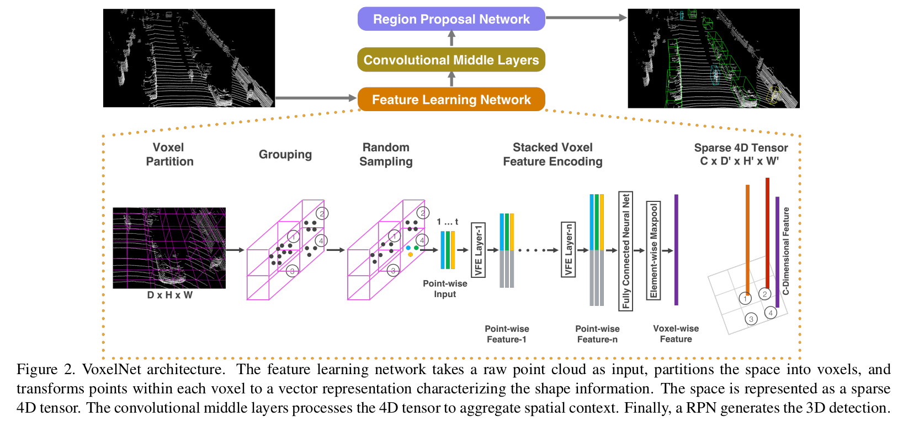

__Feature Learning Network__

1. Grouping
将空间分割为体素地图。

2. Random Samping
由于：原始点云数量过多，不适合直接投入网络；每个体素内点云密度不同。
所以：在每个体素内随机采样 T 个点（不足的就重复）。

3. Stacked Voxel Feature Encoding
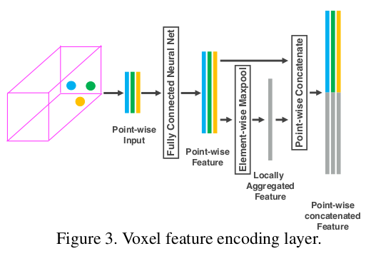
每个采样点用 7 维特征表示，包括该点的 X,Y,Z 坐标，反射强度 R，以及相对体素质心（体素内所有点位置的均值）的位置差 ΔX,ΔY,ΔZ。ΔX,ΔY,ΔZ 用来编码体素内（局部）的 surface 信息。
Fully Connected Neural Net 单独将每个采样点的特征从 7 维扩展到 m 维。
每个采样点的特征再与最大池化特征进行拼接，得到新的特征向量。相当于感受野是整个体素。
VFE layer 可以重复多次，以增强特征向量对体素 surface 的描述能力。
最终融合体素内所有采样点的特征，得到一个描述体素的特征向量。

4. Sparse 4D Tensor
输出 4D tensor。

__Convolutional Middle Layer__

采用 3D 卷积对 Z 维度进行压缩（令 stride=2）。假设 4D tensor 的维度为 HxWxDxC，经过若干次 3D 卷积后，被压缩为 HxWx2xC'，再化为 3D tensor HxWx2C'，类似于鸟瞰图。这样就可以使用图像物体检测网络（比如 Region Proposal Network）生成检测框。

__Region Proposal Network__

文中预定义了两个 anchor，长宽高不变，角度分别是 0 和 90 度。
相反朝向的物体归于同一个 anchor。换句话说，网络要学会翻转点云特征。

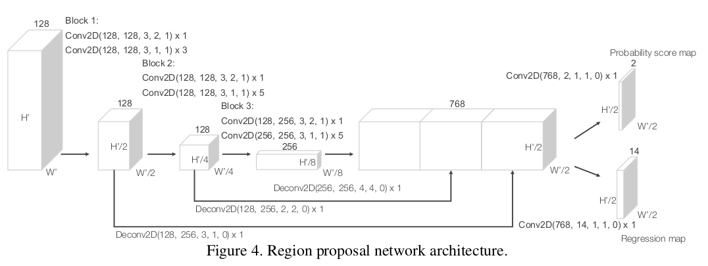

1. Regression map
ground truth box 可以用一个 7 维向量表示 $(x_c^g,y_c^g,z_c^g,l^g,w^g,h^g,\theta^g)$。
Regression map 中的 14 维向量，对应从两个 anchor 到 ground truth box 的变换 $(\Delta x,\Delta y,\Delta z,\Delta l,\Delta w,\Delta h,\Delta \theta)$。全局尺度的 x,y,z 信息没有学习的意义；估计 l,w,h 的变换量有点归一化的意思。

2. Probability score map
两个 anchor 的置信度。

3. Loss Function
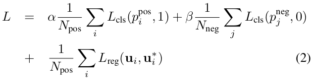
前两项为前景点和背景点的交叉熵。如果某个点估计的 b-box 与 ground truth box 的 IoU > 0.6，那么就被认为是前景点；如果 IoU < 0.45，就被认为是背景点。
第二项为前景点估计的 b-box 变换量的回归损失。

__不足__

1. convolutional middle layer 的 3D 巻积速度非常慢。
2. 网格大的话信息损失严重，网格小的话浪费计算资源。

### PointNet

网络的输入直接是点云数据。

__点云数据的特征__

1. 网络应该：对输入的点云数据的不同排列保持不变性。
2. 邻域点云包含有意义的局部信息。
3. 网络应该：对输入的点云数据的旋转平移变换保持不变性。

__网络结构__

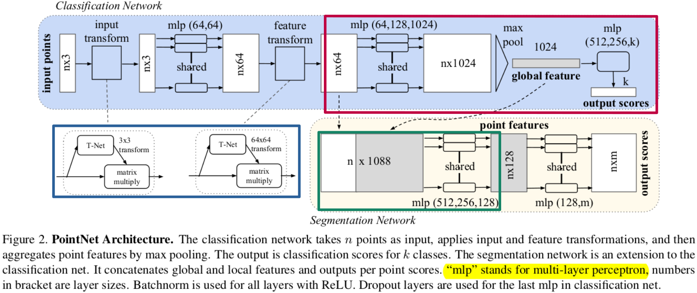

1. Symmetry Function for Unordered Input
红框部分，使用 max pool 这个对称函数来提取点云数据的特征，以此保证提取出来的 global feature 不随点云排序的改变而改变。

2. Local and Global Information Aggregation
绿框部分，将局部特征和全局特征串联。
局部特征没有用到邻域信息，这个问题在 PointNet++ 中做了完善。

3. Joint Alignment Network
蓝框部分，在进行特征提取之前，使用 T-Net 对点云数据/特征进行对齐，以保证旋转平移不变性。
输入的点云经过 T-Net 会获得一个 3x3 的仿射变换矩阵，用这个矩阵与原始点云相乘得到新的 nx3 点云；同样的方法可以应用到特征空间，但是在特征空间中仿射变换矩阵太大了，所以通过在损失函数中增加正则化约束，以使该矩阵尽量为正交矩阵。

__定理__

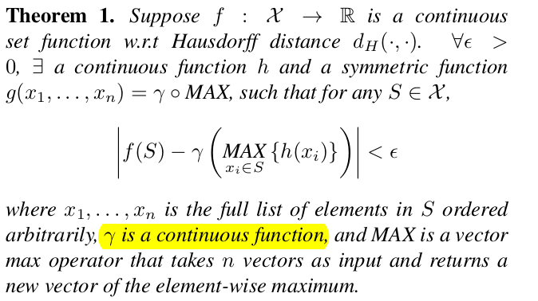
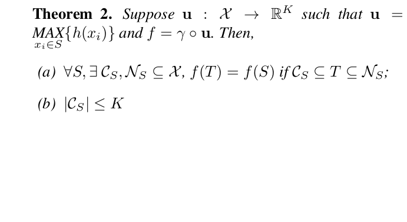

1. Universal approximation
定理 1 说明红框部分的网络结构能够拟合任意的连续集合函数。

2. Bottleneck dimension and stability
定理 2(a) 说明对于任何输入数据集 S，都存在一个最小集 Cs 和一个最大集 Ns，使得对 Cs 和 Ns 之间的任意集合 T，其输出等于 S。换句话说，模型对输入数据在有噪声和有数据损坏的情况下都是鲁棒的。
定理 2(b) 说明 Cs (critical point set) 的尺寸上界由 K (bottleneck dimension) 给出。

### PointNet++

PointNet 提取的全局特征能够很好地完成分类任务，但其局部特征提取能力较差，很难对复杂场景进行分析。
PointNet++ 提出了多尺度特征提取结构，能够有效提取局部特征。

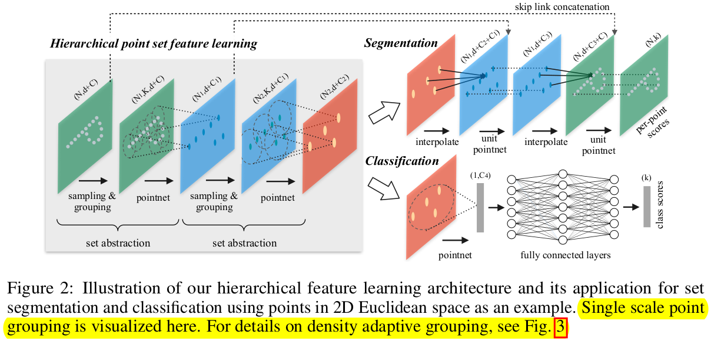

__Hierarchical Point Set Feature Learning__

1. Sampling layer
使用 farthest point sampling (FPS) 算法，对点云进行采样。

2. Grouping layer
输入：大小为 (N,d+C) （d 为坐标，C 为特征）的点云数据；大小为 (N',d) 的采样点数据。
输出：大小为 (N',K,d+C) （K 为采样点的邻域点个数）的点云数据。

3. PointNet layer
使用 pointnet 提取局部区域特征。
输出：大小为 (N‘,d+C’) 的点云数据。

__Robust Feature Learning under Non-Uniform Sampling Density__

用稠密点云训练出来的网络，应用到稀疏点云上可能就会失效。
解决方法：采用 multi-resolution grouping 方法。

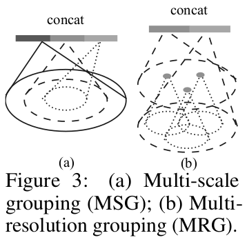

1. Multi-scale grouping
用 pointnet 分别学习不同尺度的 group 特征，并 concat。训练时，每个 group 随机丢弃一些点，以适应不同的点云密度。
大尺度 group 的特征学习，很耗费计算资源。

2. Multi-resolution grouping
每一层的局部特征都由两个向量串联构成：用 set abastraction 学习上一层的输出；用 pointnet 学习原始点云数据。
当点云密度小的时候，前一个特征变得不可靠，于是后一个特征发挥作用。

__Point Feature Propagation for Set Segmentation__

对于 segmentation 任务，还需要将下采样后的特征进行上采样。
方法：插值、跳层连接、unit pointnet。

## 发展期（2018～2020）

__SECOND__

对 VoxelNet 的改进。采用稀疏卷积策略，避免了空白区域的无效计算，提升运行速度。

__PointPillar__

对 VoxelNet 的改进。将 3D 点云量化到 2D 平面，把落到每个 2D 网格内的点直接叠放在一起，形象的称其为 pillar。

### Point-RCNN

对 PointNet++ 的改进，提出两阶段检测器。
首先，用 PointNet++ 提取点云特征，进行前景分割；每个前景点会输出一个 b-box；再对 b-box 内的点云作进一步分析。

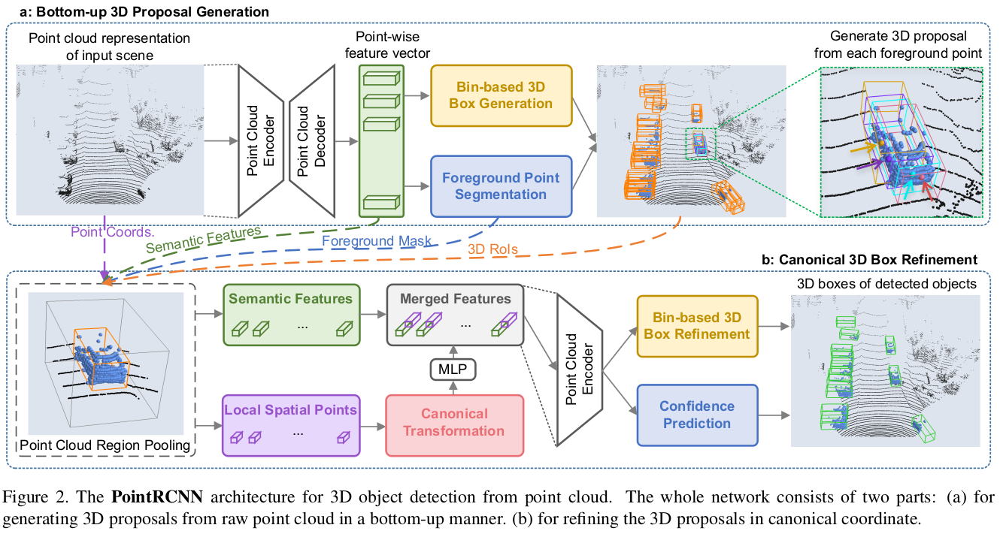

__Bottom-up 3D proposal generation via point cloud segmentation__

1. Learning point cloud representations
使用 PointNet++ 和 multi-scale grouping 来提取点云的 semantic features。

2. Foreground point segmentation
前景点分割。

3. Bin-based 3D Box Generation
VoxelNet 中设置 anchor box 的方法计算量大。
本文直接由==逐个== foreground point 估计 b-box 参数 $(x,y,z,h,w,l,\theta)$。$(x,z,\theta)$ 的估计策略是粗估（属于哪个 bin）加微调（残差）。(y,h,w,l) 的估计策略是直接微调。全局尺度的 (x,z) 信息没有学习的意义，因此使用局部坐标系。
用 NMS 策略筛选高质量的 proposal。

__Point cloud region pooling__

综合点云的：原始数据、semantic features、foreground mask，b-box。

__Canonical 3D bounding box refinement__

逐 proposal 作 refinement。

1. Canonical transformation
将 b-box 内的点云转换到其自身坐标系，以便下一阶段的局部特征学习。

2. Feature learning for box proposal refinement
综合前景点的：canonical 坐标、反射强度、与雷达间距离，==逐点==学习 local features。
拼接 local features 与 semantic features，再次输入 PointNet++。

3. Losses for box proposal refinement
类似 Bin-based 3D Box Generation。

### VoteNet

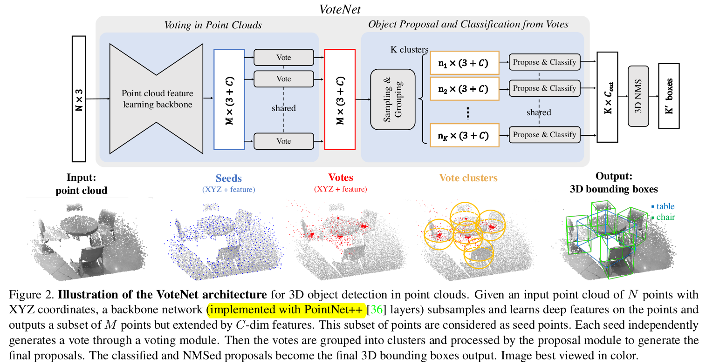

__Deep Hough Voting__

RPN 方法取置信度最大的 b-box，可以想象靠近物体中心的点云的 proposal 应该更可靠，而物体中心处的点云往往是稀疏的。因此想要提升估计精度就要扩大感受野，浪费了计算资源。

由 PointNet++ 提取 M 个特征点。==逐个==特征点经过 Vote 层，投票出中心点和中心特征向量（特征向量用以过滤低置信度的投票；同时可以继续用于后续训练，而不必追溯投票者信息）。

__VoteNet Architecture__

1. Learning to Vote in Point Clouds
==逐个==特征点经过 Vote 层，非常节省计算资源。

2. Vote clustering through sampling and grouping
首先根据坐标，采样 K 个相距最远的 vote；接着结合坐标和特征向量，寻找这 K 个 vote 的近邻。

3. Proposal and classification from vote clusters
使用 PointNet 生成 proposal。PointNet++ 中已经学习过邻域特征，所以不存在“没有使用邻域特征”的问题。

### 3DSSD

在提升 Point-RCNN 的计算效率方面作了不错的探索。

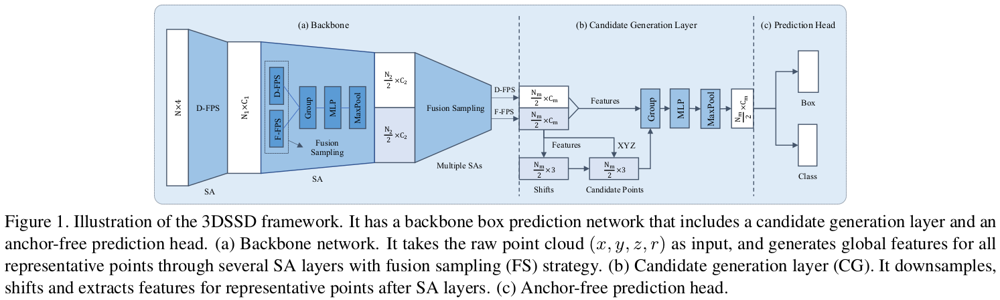

__Fusion Sampling__

测试发现，Point-RCNN 第一阶段中的 Feature Propagation 层（上采样）和第二阶段 refinement module 非常耗时。
于是想到舍弃 FP 层和第二阶段，只用 SA 层采样到的点来估计 b-box。但是 Distance-FPS 采样到的大部分都是背景点，非常浪费。于是本文采用 Feature-FPS 法进行采样，过滤掉大部分特征相似的背景点。但是如果背景点过于稀疏，那么即使扩大感受野也无法很好地学习背景特征，网络就可能会将背景点误认为是前景点。于是本文结合 D-FPS 和 F-FPS 的采样方法。

__Box Prediction Network__

1. Candidate Generation Layer
由于 D-FPS 采样到的大多为背景点，所以仅使用 F-FPS 采样到的点估计 candidate （中心点）。
每个 candidate 都最终要估计一个 b-box。这里为什么不像 VoteNet 一样，先对 candidate 聚类，再估计 b-box 呢？

2. Anchor-free Regression Head
为了进一步提升效率，使用 anchor-free 的 regression-head，估计 $(d_x,d_y,d_z,d_l,d_w,d_h,\theta)$。其中 $\theta$ 采用 Point-RCNN 中 bin+res 策略。

3. 3D Center-ness Assignment Strategy
中心度就是靠近 b-box 中心的程度。一些中心度较小的 candidate points 回归的检测框虽然可能有较大的置信度分值，但是质量确实不太好。因此最后的 class label = $l_{mask}(0,1) \times l_{ctrness}$。

__Loss Function__

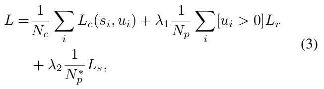

第一项为 candidate points 的 class score 和 class label 的交叉熵。
第二项为 regression loss，包含位置、尺寸、角度、角点。
第三项为 shift loss，用以监督 shifts 层。

### PV-CNN 

本文提出了一种对点云提取特征的方法，可以应用到更广的网络结构中。

__voxel-based 与 point-based 方法的不足之处__

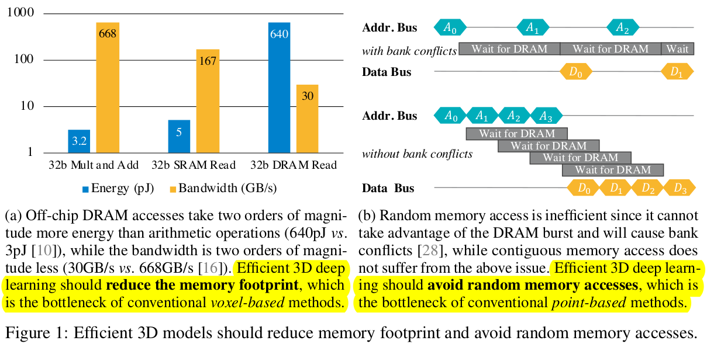

1. voxel-based
图 1(a) 表明，相比于算术运算，内存操作消耗的时间和能量更为昂贵。
而 voxel-based 方法的内存消耗与分辨率成三次相关，是巨大的。

2. point-based
图 1(b) 表明，随机内存访问非常低效。
而 point-based 方法的点云存储是无序的，所以在近邻查找时非常低效。
另外，有些 point-based 方法会根据点云相对位置关系使用动态卷积核。这一步操作同样很低效。

__网络结构__

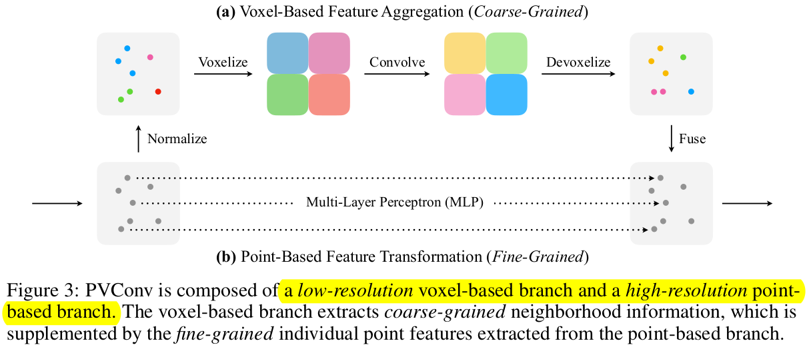

1. Voxel-Based Feature Aggregation
先将点云坐标归一化到单位球内。
再将空间体素化，将体素内的点云特征取均值作为体素特征。
再作 3D 巻积。
最后插值得到每个点云的邻域特征。

2. Point-Based Feature Transformation
==逐点==学习点云的自身特征。

3. Feature Fusion
拼接点云的邻域特征和自身特征。

point-based 分支其实就是 PointNet。voxel-based 分支用 3D 巻积提取邻域特征，而 PointNet++ 用 SA 提取邻域特征。实验表明，3D 巻积提取邻域特征更快也更好。

### PV-RCNN

也是一个两阶段检测器。

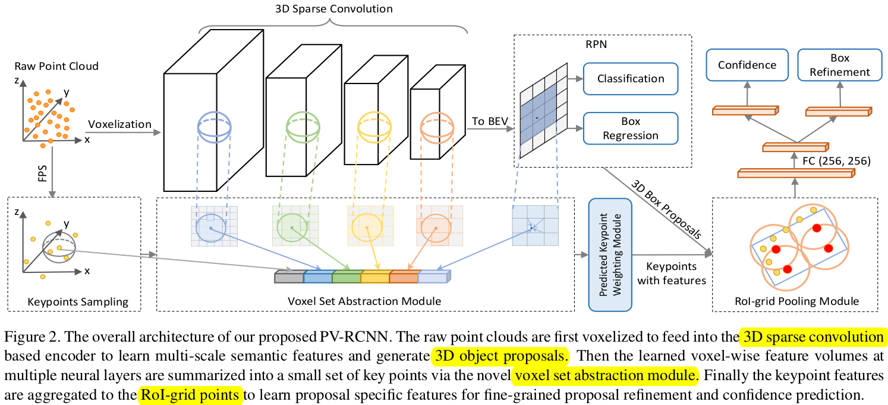

__3D Voxel CNN for Efficient Feature Encoding and Proposal Generation__

1. 3D voxel CNN
空间体素化；将体素内的点云特征取均值作为体素特征；进行稀疏巻积；最终输出 8 倍降采样的 3D 特征地图。

2. 3D proposal generation
堆叠 z 轴特征，得到 2D 特征地图；沿袭 VoxelNet，设置 anchor，每一类物体都有 $2 \times \frac{L}{8} \times \frac{W}{8}$ 个 anchor。

__Voxel-to-keypoint Scene Encoding via Voxel Set Abstraction__

1. Keypoints Sampling
FPS 法采样。

2. Voxel Set Abstraction Module
在不同尺度下（蓝绿黄红）索引特征点的邻域体素；将邻域体素特征集合输入 PointNet，输出该尺度下的邻域特征向量；最后将不同尺度下的邻域特征向量拼接。

3. Extended VSA Module
将原始邻域点云输入 PointNet，输出原始邻域特征向量（灰），进行拼接；对 2D 特征地图进行插值，得到鸟瞰特征向量（紫），也进行拼接。

4. Predicted Keypoint Weighting
前景点对 proposal 的 fine tune 应该发挥更大的作用，因此这一步估计每个特征点的权重（前景点权重更大）。

__Keypoint-to-grid RoI Feature Abstraction for Proposal Refinement__

1. RoI-grid Pooling via Set Abstraction
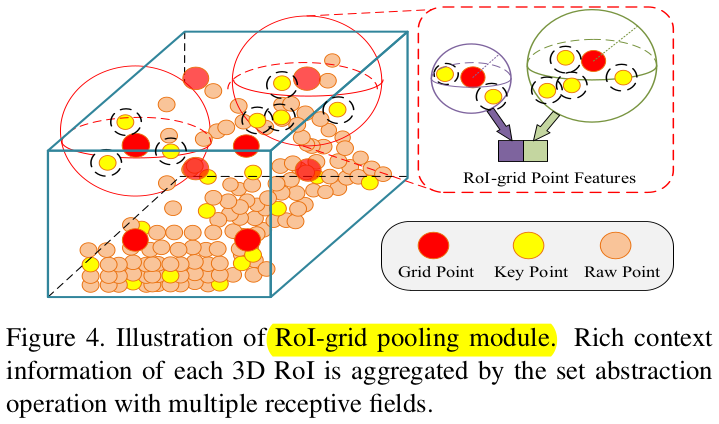
对每个 proposal 生成 6x6x6 的 grid，grid 的中心点称为 grid point；对每个 grid point 取邻域特征点作 set abstraction 操作，得到 grid point 的特征向量；将这些特征向量投入后续网络，优化 proposal。
与 Point-RCNN 相比（同为两阶段检测器），此处用于 fine tune 的 grid point 特征还融合了背景特征。

## 落地期（2021～）

### Voxel R-CNN

也是一个两阶段检测器。
只用 voxel 提取特征，结构更加简洁。

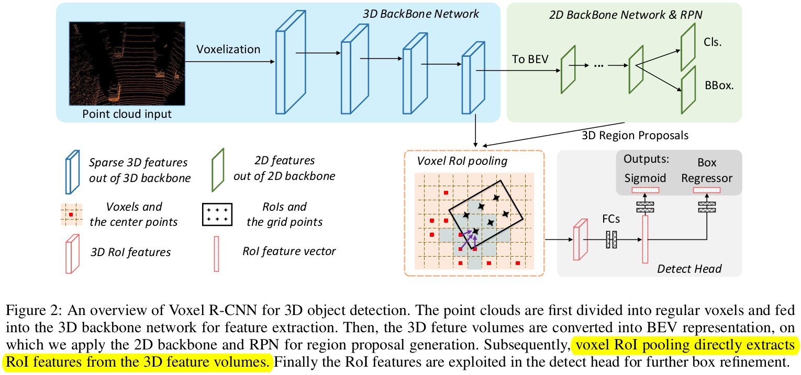

__Voxel RoI Pooling__

1. Voxel RoI Pooling Layer
对每个 proposal 生成 GxGxG 的 grid，grid 的中心点称为 grid point；对每个 grid point 取 K 个邻域体素输入 PointNet，得到 grid point 的特征向量。

2. Accelerated Local Aggregation
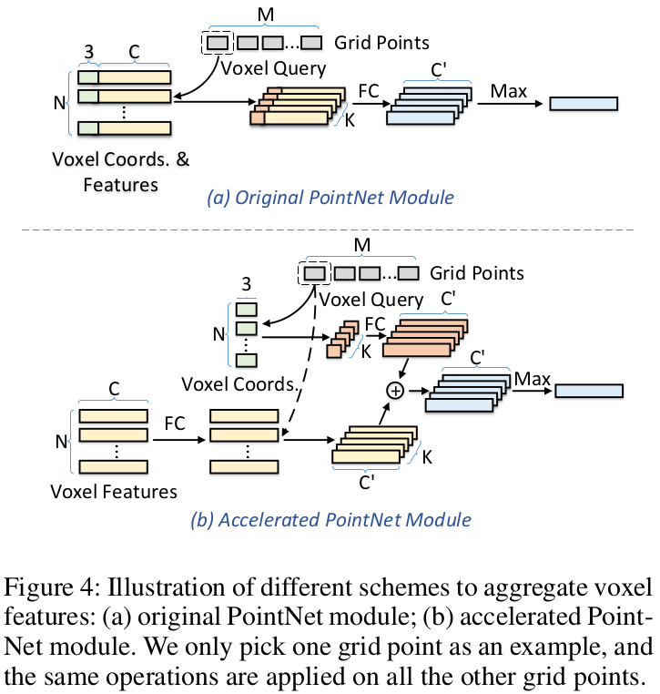
对于 M 个 grid points，PointNet 每次都要全连接 K 个 (C+3) 长度的输入与 1 个 C' 长度的输出，FLOPs 为 O(MxKx(C+3)xC')。
但是，全连接层对特征向量 (NxC) 进行了多次重复运算，非常低效。
于是提出先对特征向量 (NxC) 进行全连接运算，再 query，FLOPs 降为 O(M×K×3×C'+N×C×C')。

### CIA-SSD

是一个基于 voxel 的单阶段检测器。
CIA-SSD 之后被扩展为 SE-SSD，速度为 33 FPS，AP 提升到 82.54%，甚至超越了两阶段检测器。

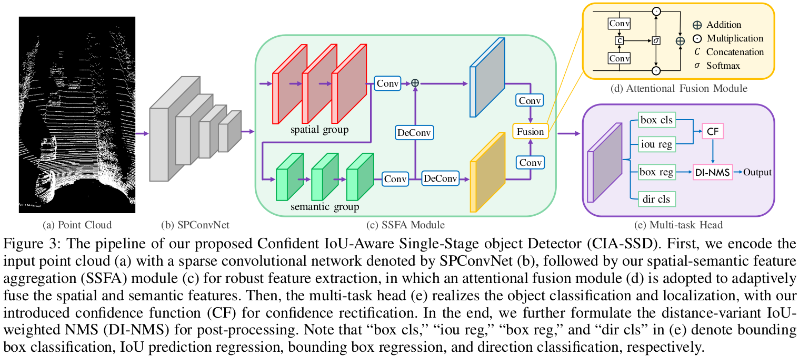

__Point Cloud Encoder__

空间体素化，将体素内的点云平均坐标和点云密度作为体素起始特征，投入 SPConvNet，最后拼接 z 方向特征得到 2D 特征地图。
直接忽略了体素内的局部特征，却依然取得了很好的效果。

__Spatial-Semantic Feature Aggregation__

降采样学习 semantic feature 时，会损失 spatial feature 的信息。所以学习 spatial feature 时不改变特征地图的尺寸；而学习 semantic feature 时，特征地图的通道扩大两倍，尺寸缩小 1/2。
fusion 模块将两张特征地图压缩为两个特征向量，再拼接，再 softmax，再重新拆为两个权重向量，用于自适应地融合 spatial 特征与 semantic 特征。

__IoU-Aware Confidence Rectification__

e 模块中的 iou reg 用于预测 IoU 的值。
IoU 是可预测的，因为如果当前的体素拥有足够丰富的特征，那么预测出来的 b-box 应该更准，IoU 应该更大。
预测 IoU 的作用类似于 3DSSD 中计算 centerness 的作用，用于更新置信度。

__Distance-Variant IoU-Weighted NMS__

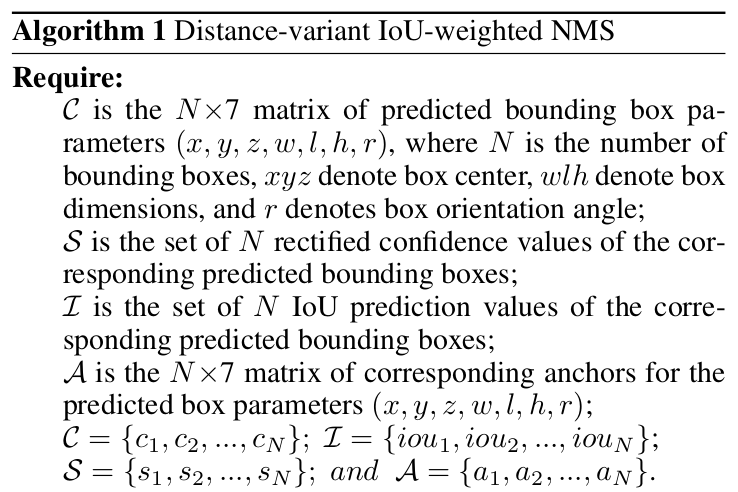
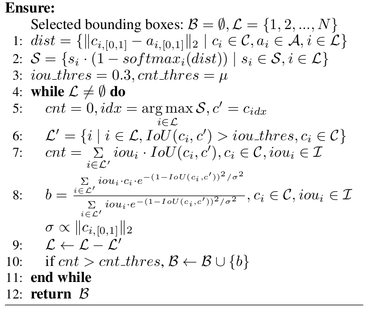

远处的点云比较稀疏，有可能产生 false-positive candidate。

1~2: 用 centerness 进一步更新置信度。
5~7: 取置信度最高的 b-box：c'；筛选 c' 的支持集：L'；统计 c' 的票数。这一步可以过滤掉 false-positive candidate。
8: 拟合 c' 投票集的高斯分布，fine tune b-box。

## 2023

### VoxelNeXt: Fully Sparse VoxelNet for 3D Object Detection and Tracking

__CVPR 2023__

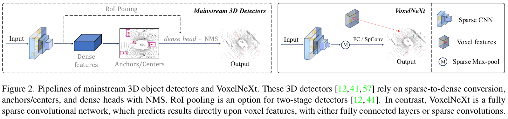

大部分 3D 检测网络都会包含：Sparse-to-Dense Convertion, Anchors/Centers, NMS, RPN, Dense head, ROI Pooling 这些非常耗时的计算环节。本文以简洁的网络结构兼顾了计算效率与精度。

个人感觉本文的核心思想类似 VoteNet。区别在于 VoteNet 综合考虑了多个边界点的投票信息；而本文直接相信了特征最丰富的体素的预测结果。

__Fully Sparse:__
1. 空间中的大部分体素都不含点云，或者特征不明显，因此不应该在这些体素上浪费计算资源。
2. 大部分 3D 检测网络一般通过扩大感受野来计算物体中心的特征向量，但是物体中心一般不含点云，因此更加高效的方法是通过物体边界上的点云直接预测 b-box。

__Detailed designs:__

1. Two additional down-sampling
实验表明，更大的感受野有助于提升精度；降采样比增大 kernel size 效率更高。
2. Sparse Height Compression
省略 z 轴特征，节省计算量。
3. Spatially Voxel Pruning
删除特征不明显的 voxel，节省计算量。
4. Sparse Max Pooling
用 Sparse Max-pool 代替 NMS，节省计算量。

## 参考文献

https://www.51cto.com/article/701356.html

# 物体语义分割与实例分割

### RandLA-Net

大场景下的点云语义分割：用 attractive pooling 代替 max pooling，保留更多的局部信息；用随机采样替换 FPS，提升效率。

### 3D-BoNet

点云实例分割：两阶段方法，先预测 b-box，再实例分割。

### 3D-MAN

多帧融合的目标检测：单视角点云图可能存在歧义；大多数的目标检测公开数据集都是单帧的；而且不难想象点云序列越长，点云畸变会越严重。

### FlowStep3D

自监督场景流估计：输入连续两帧点云数据，估计点云场景流。

### OGC

基于 FlowStep3D 的自监督点云实例分割：基于学到的场景流，作实例分割；再用分割得到的实例，校正场景流。迭代，优化结果。

