<!-- @import "[TOC]" {cmd="toc" depthFrom=1 depthTo=6 orderedList=false} -->

<!-- code_chunk_output -->

- [论文](#论文)
  - [DAMS-LIO: A Degeneration-Aware and Modular Sensor-Fusion LiDAR-inertial Odometry](#dams-lio-a-degeneration-aware-and-modular-sensor-fusion-lidar-inertial-odometry)
  - [ImMesh: An Immediate LiDAR Localization and Meshing Framework](#immesh-an-immediate-lidar-localization-and-meshing-framework)
  - [Efficient and Probabilistic Adaptive Voxel Mapping for Accurate Online LiDAR Odometry](#efficient-and-probabilistic-adaptive-voxel-mapping-for-accurate-online-lidar-odometry)
  - [ROG-Map: An Efficient Robocentric Occupancy Grid Map for Large-scene and High-resolution LiDAR-based Motion Planning](#rog-map-an-efficient-robocentric-occupancy-grid-map-for-large-scene-and-high-resolution-lidar-based-motion-planning)
  - [BEVFusion: A Simple and Robust LiDAR-Camera Fusion Framework](#bevfusion-a-simple-and-robust-lidar-camera-fusion-framework)
- [问题与算法](#问题与算法)

<!-- /code_chunk_output -->

## 论文

### DAMS-LIO: A Degeneration-Aware and Modular Sensor-Fusion LiDAR-inertial Odometry

__浙大 2023 收录于 arXiv__

地下矿山和行星表面等复杂极端环境下，LiDAR + IMU 可能不足以完成准确的状态估计。本文基于 LIO，提出了一种可感知退化的模块化多传感器融合方案，仅在感知到退化时才在状态估计过程中引入更多的传感器信息。

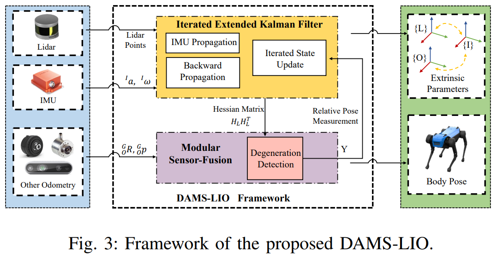

__创新点：__
1. 提出了一种基于退化感知和模块化传感器融合的轻量级激光雷达-惯性测程系统 DAMS-LIO，该系统能够在极端环境下进行鲁棒和准确的状态估计，在计算资源有限的情况下，为机器人执行复杂探测任务提供了明显的优势。
2. 提出了一种新的传感器融合方法，将激光雷达和其他里程计的信息完全融合，仅在检测到退化时，将激光雷达点和其他里程计的相对位姿作为更新过程中的测量值。
3. 基于 CRLB 定理（用于衡量一个无偏估计器是否是有效的）进行了理论分析，以量化性能，并证明了所提出的传感器融合方法拥有更高的精度。
4. 在模拟和真实数据集上的大量实验验证了该方法的鲁棒性和准确性。

### ImMesh: An Immediate LiDAR Localization and Meshing Framework

__港大火星 2023 收录于 arXiv__

本文的关键贡献在于其网格划分模块，该模块通过一种高效的层次化体素结构来表示场景，并以增量的方式重建每个体素中的三角面片。

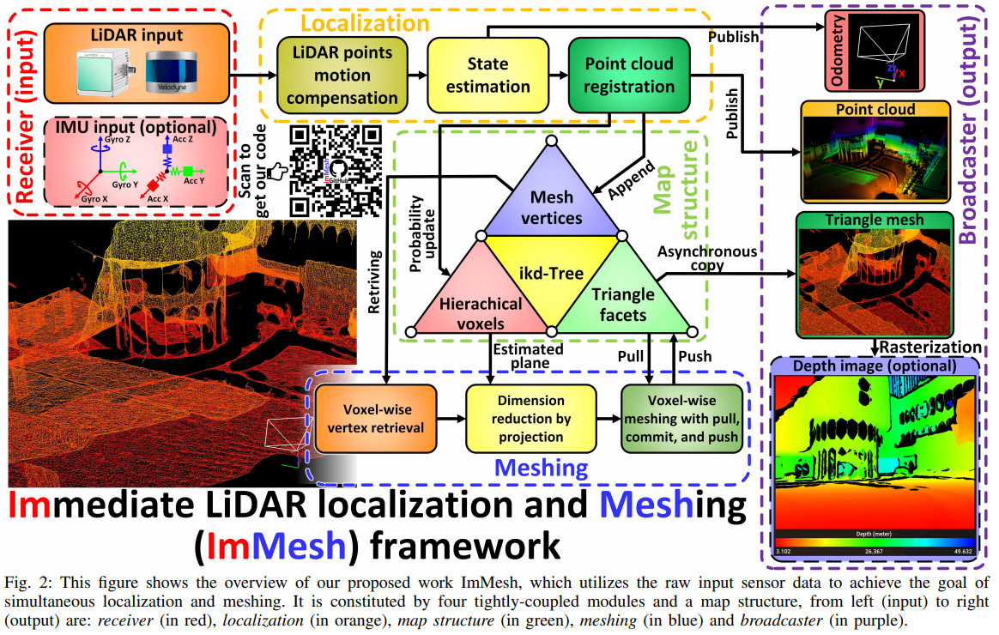

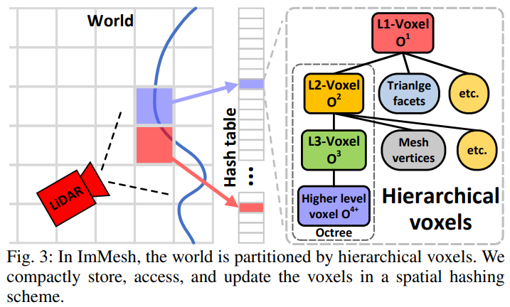

__创新点：__
1. 我们在 VoxelMap 的基础上提出了一套可以在线估计传感器姿态和重建周围环境网格的系统。
2. 该系统的网格划分模块实现了一种新颖的网格重建方法。
3. 通过大量的实验对 IMMesh 的运行时间性能和网格划分精度进行了评估。
4. 还通过两个实际例子演示了 IMMesh 的潜在应用场景。

__技术细节：__
==VI-C Voxel-wise vertex retrieval:==
L2-Voxel 内部存储了指向所有 vertices 的 pointer array。但是如果仅对这些 vertices 做 meshing 操作的话，L2-Voxel 之间会有 gap。因此，本节提出的 voxel-wise vertex retrieval 就是去邻域 Voxel 搜刮一些 vertices。

==VI-D Dimension reduction by projection:==
在 VI-C 获得的 vertices 内做 meshing 操作。由于 3D meshing 比较耗时，又由于 L2-Voxel 内的 vertices 往往落于同一平面上（这个平面可以通过估计 vertices 的特征向量来获得）。因此，本节将 3D vertices 投影到该平面，用 2D Delaunay triangulation 方法完成 meshing 操作，再将点投影回 3D 坐标系。

==VI-E Voxel-wise meshing with pull, commit, and push:==
meshing 完需要更新版本库，分为三步：pull，commit，push。
pull：输入 VI-C 获得的 vertices，拉取版本库中角点属于该 vertices 的 triangle facets。
commit：将 VI-D 获得的 triangle facts 与 pull 获得的 triangle facts 作比较，生成 add/erase list。
push：根据 add/erase list 更新版本库。

### Efficient and Probabilistic Adaptive Voxel Mapping for Accurate Online LiDAR Odometry

__港大火星 RA-L 2022__

__创新点：__
1. 提出了一种 coarse-to-fine 的体素构建方法。
2. 体素地图中的每个特征平面都考虑了不确定度信息。
3. 通过大量实验和数据集对本方法进行了评估。

__技术细节：__
==III-A Probabilistic Plane Representation:==
将测量到的点云转换到世界坐标系中，有两个误差来源：measurement error（包括深度和方向）和 state estimation error。本节给出了平面拟合不确定度的数学表示。

==III-B Coarse-to-fine and Efficient Voxel Map Construction:==
空间先 coarse 体素化，期望一个体素内的点云落于同一平片。如果期望不成立，那么将该体素切割为 8 块小体素。我们存储体素内的平面信息：法向量、重心、不确定度。
每个体素内只维护最新的 10 个点，每次用这 10 个点重新计算平面信息。

==III-C Point-to-plane Match:==
某帧点云利用 state estimation 先验，与 map 中的面匹配。先计算某特征点落于哪块 coarse 体素。再计算该点与该体素内所有面之间的距离。这里强行扯了概率分布公式，再次用到了 Section III-A 中的不确定度，其实就是找距离最小的面作为匹配面。

### ROG-Map: An Efficient Robocentric Occupancy Grid Map for Large-scene and High-resolution LiDAR-based Motion Planning

__港大火星 2023 收录于 arXiv__

维护了一个随机器人移动的局部体素地图。激光射线如果透过某一体素，说明这个体素里应该没有障碍物。

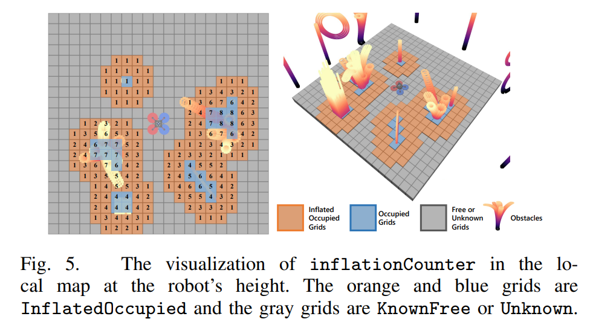

__创新点：__
1. 提出了一个基于均匀网格的 OGM 包。它的零拷贝地图滑动策略使其能够高效维护一个与机器人共同移动的局部地图，使其适合在高分辨率和大规模环境中运行。
2. 提出了一种新的增量膨胀方法。这种方法可以实现更快的障碍物膨胀，并具有与现有方法一致的精度。
3. 通过大量实验和数据集对本方法进行了评估。

__技术细节：__
==III OCCUPANCY GRID MAP:==
如果点云落在某体素格，记该格为 hit；如果射线穿过某体素格，记该格为 miss。基于连续的观测，可以估计每个体素格的 occupancy probability。

==IV-A Robocentric Local Maps==
global map 的定义域是 $[-\infty,+\infty]$，但我们关心的是 local map。本节提出了一种坐标映射方法，无需机器人位置信息，就可以将机器人 s 范围内的网格坐标映射到定义域是 $[0,s-1]$ 的 local map。local map 随着机器人的运动定期更新。

==IV-B Probabilistic Update and Incremental Inflation==
ray casting：对于每帧点云，遍历所有点，寻找 hit 和 miss，记录在 C cache 中。
更新 hit 与 miss 的 occupancy probability。
obstacle inflation：Fig 5 计算每个体素的邻域中有几个 occupied grid。


### BEVFusion: A Simple and Robust LiDAR-Camera Fusion Framework

__北大王选 CVPR 2022__

__背景知识__
==激光雷达和视觉的融合策略分为三种类型：== 决策层融合（后融合），决策 + 特征融合（中间层融合），特征融合（前融合）。

后融合是将基于激光雷达的模型输出的最终结果，比如 3D BBox, 和视觉检测器输出的最终结果，比如 2D BBox, 通过滤波算法进行融合；中间层融合是将某一个模态输出的最终结果，投影到另一种模态的深度学习特征层上，然后再利用一个后续的融合网络进行信息融合；前融合则是直接在两种模态的 Raw Data 或者特征层上进行融合，然后利用神经网络直接输出最终的结果。

工业界普遍使用的是后融合方案，因为这种方案比较灵活，鲁棒性也更好，不同模态的输出结果通过人工设计的算法和规则进行整合，不同模态在不同情况下会有不同的使用优先级，因此能够更好地处理单一传感器失效的情况。

学术界比较推崇的是前融合方案，因为这种方案能够更好地利用神经网络端到端的特性。但是这种方案鲁棒性达不到实际要求, 尤其是当激光雷达信号出现问题时，目前的前融合方案几乎都会失效。

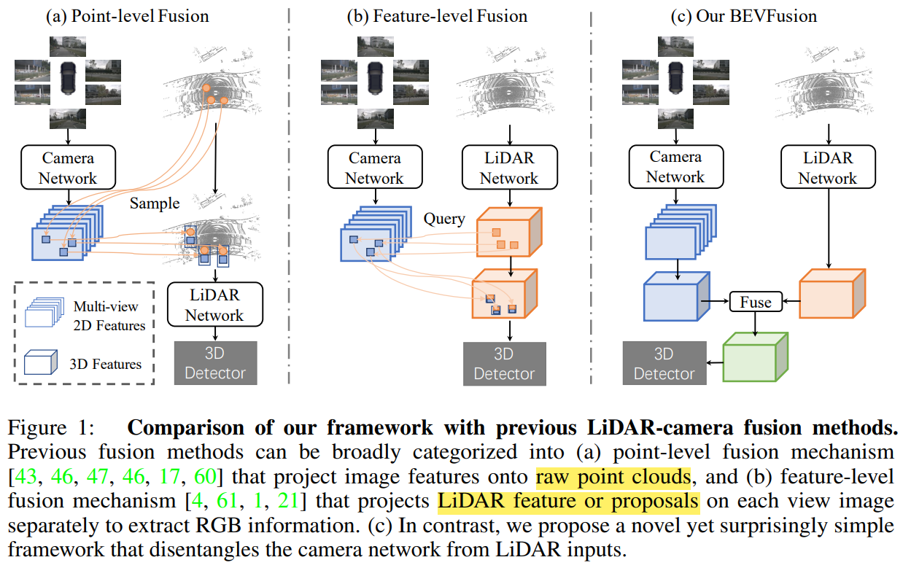

__创新点：__
本文提出了 BEVFusion 的框架，独立处理点云和图像，利用神经网络进行编码，投射到统一的 BEV 空间，然后将二者在 BEV 空间上进行融合。这种情况下激光雷达和相机没有了主次依赖，从而能够实现近似后融合的灵活性：当某一模态缺失或者产生噪声，单一模态依然可以独立完成任务，而当增加多种模态后，整体性能会大幅提高。

__技术细节：__

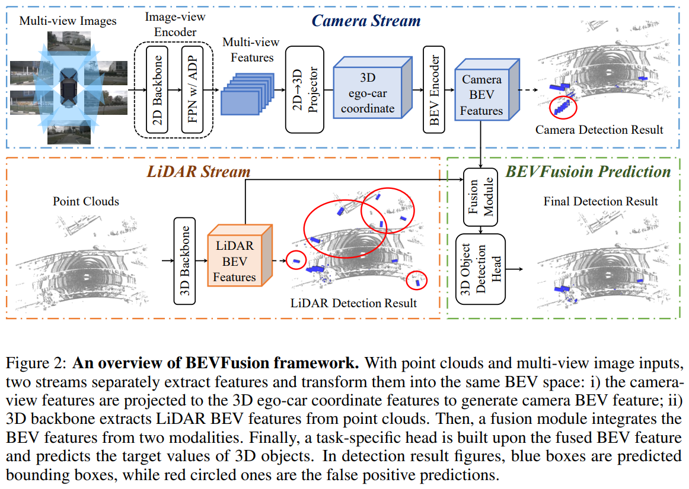

==3.1 Camera stream architecture: From multi-view images to BEV space==
Image-view Encoder：将多视角照片编码为特征信息。
View Projector Module：输入特征信息，估计对应像素的深度（2D 转换为 3D）。
BEV Encoder Module：堆积 Z 轴特征信息（3D 转换为 BEV）。

==3.2  LiDAR stream architecture: From point clouds to BEV space==
利用了早期的 LiDAR BEV 网络。

==3.3 Dynamic fusion module==
Fusion：图像特征 [X,Y,Cc] 与点云特征 [X,Y,Cl] 堆叠为 [X,Y,Cc+Cl]，再卷积降采样为融合特征 [X,Y,Cl]。
Adaptive Feature Selection：融合特征池化卷积激活后，再与自身点乘，保留有用的特征并遗忘无用的特征。

==3.4 Detection head==
利用了早期的 LiDAR BEV 网络。

## 问题与算法

__edge effect__

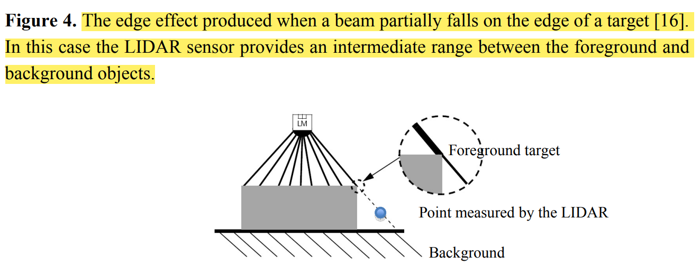

在手术室这种拥挤复杂的场景，edge effect 更为明显，会影响 state estimation 的精度，也会产生很多噪声。

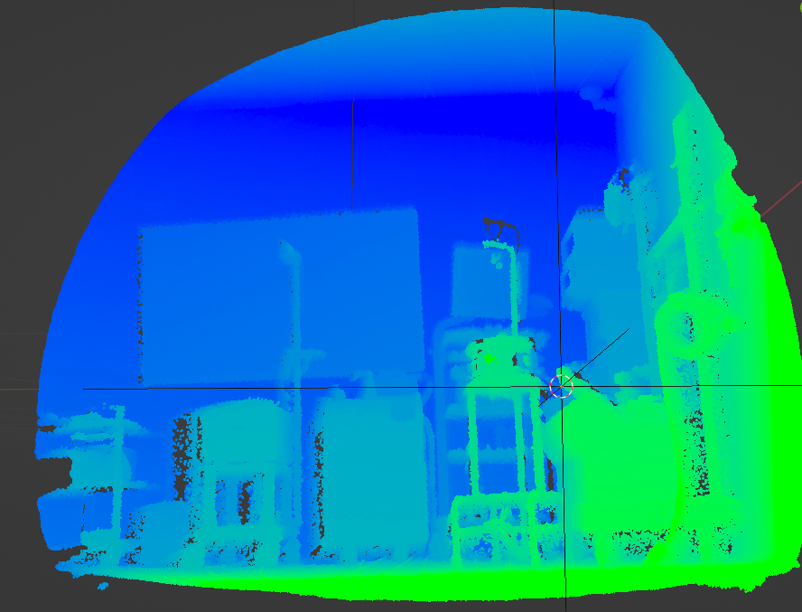
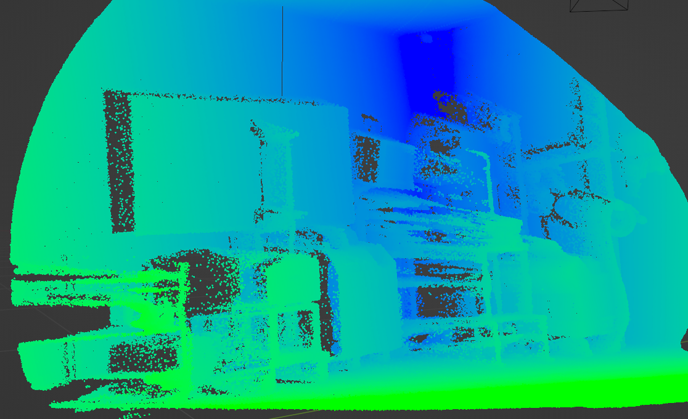
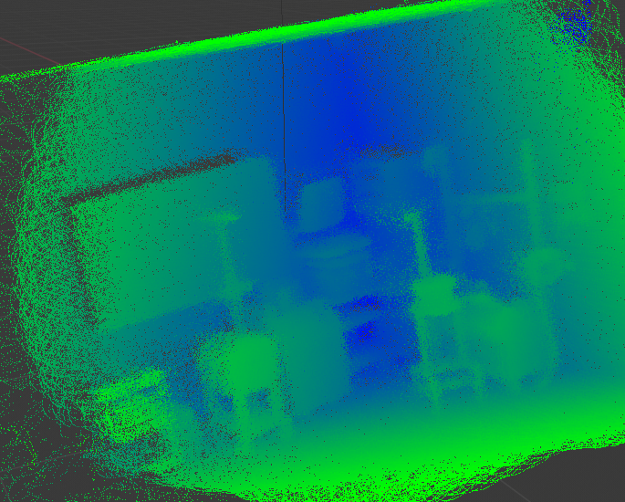

__mirror effect__

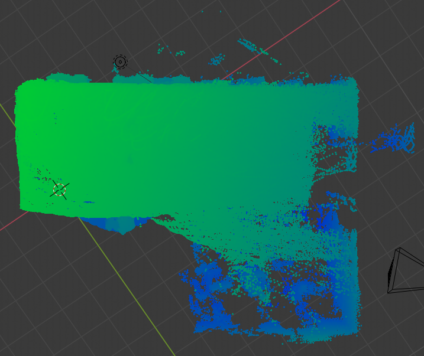

__算法改进__

```python{.line-numbers}
Notation: Input voxels of one frame V_k; The updating candidates U.
Algorithm
  for(v : V_k) do
    // 单帧扫到的每个体素 v，单独做一次线性搜索，找到所有相关的体素 U。
    U = raySearching(v)
    for(u : U) do
      // 每个相关体素 u 的 occupancy 概率应该降低；但如果某个 u 的 occupancy 概率很高，那么应该认为 v 无效。
      (u,v) = updateProbability(u,v)
      // voxel map 中仅维护 occupancy 概率高于某阈值的体素。
      updateVoxelMap()
    end
  end
Algorithm End
```

1. 蓝色扫描出现错误点（edge effect），绿色扫描剔除错误点。
2. 蓝色扫描出现错误点（mirror effect），但被地图中的 occupancy voxel 无效化。

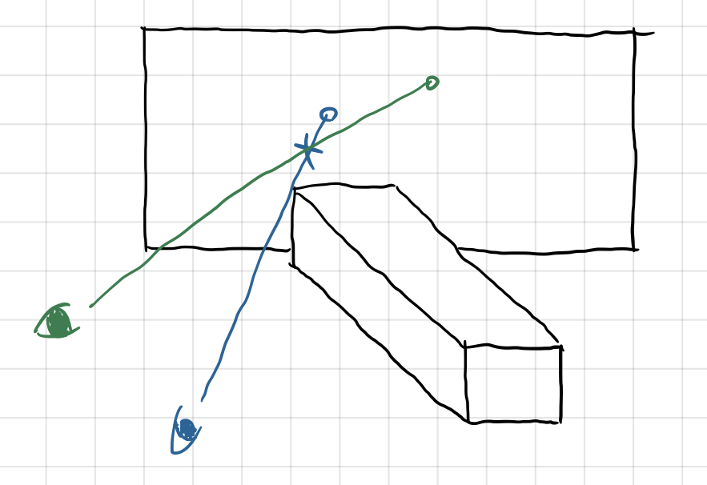
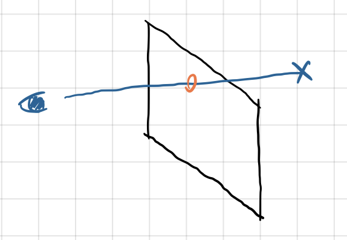

3. 轻微运动的物体（如无菌手术单），其体素内的点云分布均匀，无明显的平面，所以不会对 state estimation 产生明显影响。
4. 剧烈运动的物体（如医生），蓝色扫描获取的物体点，会随着物体的离开，在绿色扫描时被认为是 not occupied。

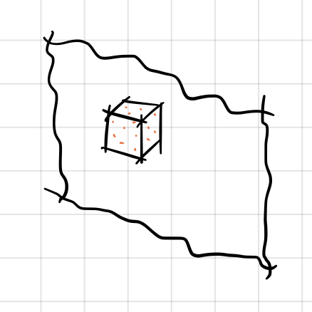
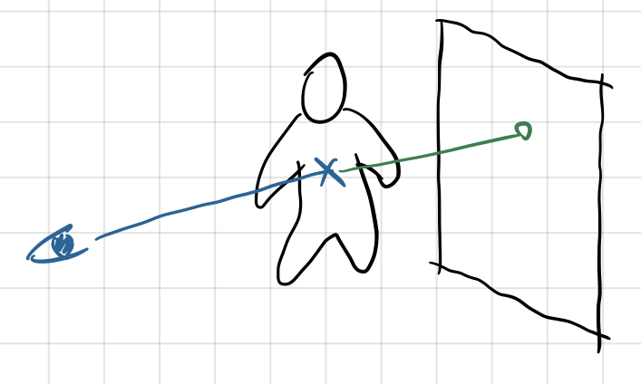
