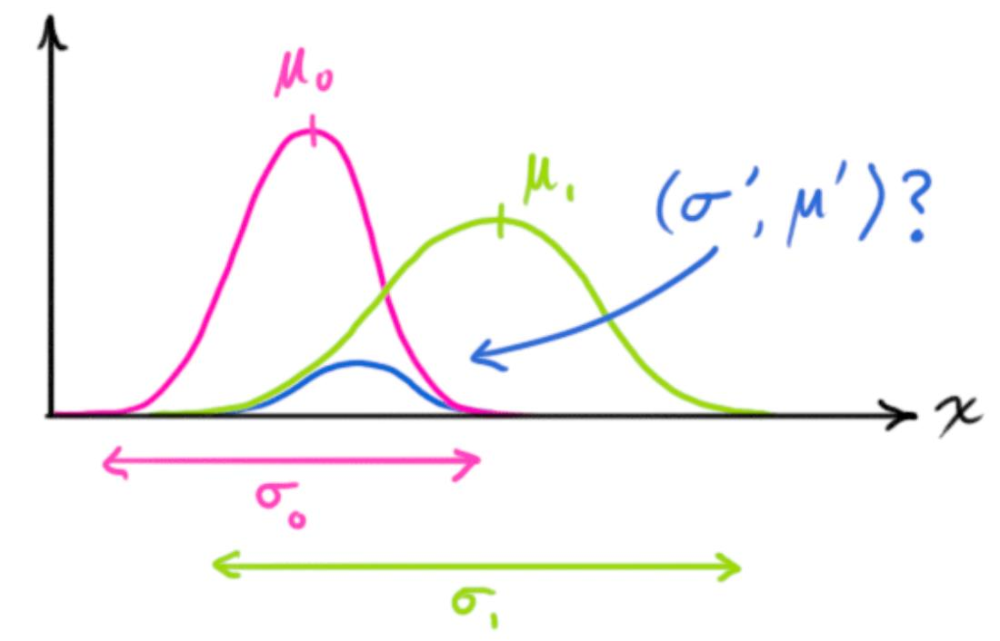
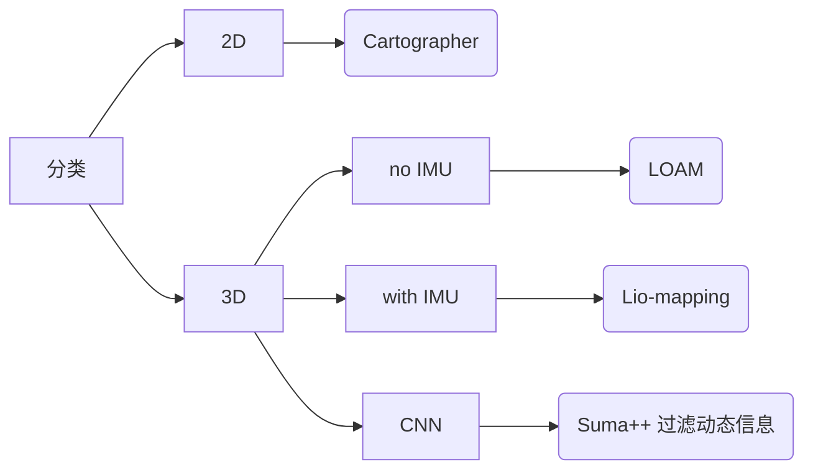
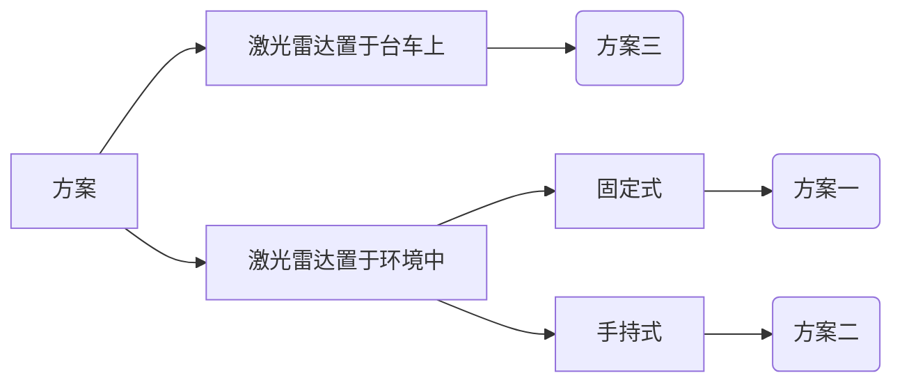

<!-- @import "[TOC]" {cmd="toc" depthFrom=1 depthTo=6 orderedList=false} -->

<!-- code_chunk_output -->

- [问题描述](#问题描述)
- [知识储备](#知识储备)
  - [关于 LiDAR](#关于-lidar)
  - [关于 KF](#关于-kf)
  - [关于四元数](#关于四元数)
  - [关于哈希表](#关于哈希表)
- [一些文章](#一些文章)
  - [LOAM: Lidar Odometry and Mapping in Real-time](#loam-lidar-odometry-and-mapping-in-real-time)
  - [FAST-LIO: A Fast, Robust LiDAR-Inertial Odometry Package by Tightly-Coupled Iterated Kalman Filter](#fast-lio-a-fast-robust-lidar-inertial-odometry-package-by-tightly-coupled-iterated-kalman-filter)
  - [FAST-LIO2: Fast Direct LiDAR-Inertial Odometry](#fast-lio2-fast-direct-lidar-inertial-odometry)
  - [Kalman Filters on Differentiable Manifolds](#kalman-filters-on-differentiable-manifolds)
  - [Faster-LIO: Lightweight Tightly Coupled Lidar-Inertial Odometry Using Parallel Sparse Incremental Voxels](#faster-lio-lightweight-tightly-coupled-lidar-inertial-odometry-using-parallel-sparse-incremental-voxels)
- [FAST-LIO2 源码梳理](#fast-lio2-源码梳理)
  - [主循环](#主循环)
  - [消息格式](#消息格式)
- [一些公司](#一些公司)
  - [Velodyne](#velodyne)
- [方案](#方案)

<!-- /code_chunk_output -->

## 问题描述

__基于激光雷达的手术室环境感知。__
用一个激光雷达，扫描感知手术室环境，实现自动 docking 过程中的避障和路径规划。

## 知识储备

### 关于 LiDAR

__常见种类__

1. <font color=OrangeRed>机械式：</font>不断旋转发射器，化点为线（如果是多线激光雷达，则化线为面）。
2. <font color=OrangeRed>半固态式：</font>驱动 MEMS 旋镜，反射激光束指向不同方向。
3. <font color=OrangeRed>光学相控阵式 (OPA)：</font>若干相控单元组成阵列，独立控制每个单元，实现在设定方向的干涉相长相消。
4. <font color=OrangeRed>泛光面阵式 (FLASH)：</font>直接发射出一大片覆盖探测区域的激光，再依靠高度灵敏的接收器接受反射信号。

前两种车厂较为常用。

__工作原理__

以产品 VLP-16 为例


多线机械式激光雷达在垂直方向发射激光时，不是同时发射。例如这款 16 线激光雷达，在垂直方向每隔 2.304 μs 发射一束激光，垂直方向一次发射循环后等待 18.432 μs，那么该激光雷达在垂直方向的一次发射循环总耗时 (2.304 x 16 + 18.432) μs。

__数据格式__

以产品 VLP-16 为例


以太网接口。使用 UDP 通讯协议。


每一帧的数据长度为 1248 字节，其中包含：42 字节的包头、12 组数据包、4 字节时间戳、2 字节雷达型号参数。
每组数据包分别包含：2 字节数据包的开始标识 (0xFFEE)、2 字节旋转角度、32 x (2 距离值 + 1 反射强度值) 字节的信息。
其中 32 x 3 字节包含雷达两次垂直扫描信息，每个数据包开头所携带的旋转角度是指当前数据包前 16 x 3 字节对应的角度，而后 16 x 3 字节对应的旋转角度没有直接给出，需要通过计算前后两次旋转角度然后求取平均值获得。

__一个问题__

旋转一圈，完成一次扫描，称为一次 scan。mapping 的一个简单思路是：利用数据包中的旋转角度信息，相对于固定的激光雷达坐标系，直接对一次 scan 得到的数据建图。<font color=OrangeRed>但事实上，在一次 scan 过程中，激光雷达坐标系的运动往往不可忽略，也就是说点云需要校畸变。</font>

### 关于 KF

<font color=OrangeRed>极大似然估计</font>

随机变量 $\theta$，在无样本信息之前，只能依据历史信息对 $\theta$ 作出判断，即先验分布 $\pi(\theta)$。现在有了一组样本观测值 $\mathbf{x}=(x_1,...,x_n)$。
极大似然估计的思想为：$\hat{\theta}$ 使 $\mathbf{x}$ 发生的可能性最大。
$$\hat{\theta}=\max_{\theta} f(\mathbf{x}|\theta)$$

<font color=OrangeRed>贝叶斯估计</font>

显然极大似然估计没有考虑先验分布。于是有了贝叶斯估计。其中 $\pi(\theta|\mathbf{x})$ 称为后验分布。
$$\hat{\theta}=E(\pi(\theta|\mathbf{x}))$$

$$\pi(\theta|\mathbf{x})=\frac{f(\mathbf{x}|\theta)\pi(\theta)}{\int f(\mathbf{x}|\theta)\pi(\theta) d(\theta)}$$

举个例子，抛硬币，正面朝上 R 的先验概率分布为 $\pi(r)=6r(1-r)$。现在抛 5 次，发现全部正面朝上，则后验概率分布为：
$$\pi(R|\mathbf{x})=\frac{r^5 6r(1-r)}{\int u^5 6u(1-u) du}=56 r^6 (1-r)$$

其期望为：
$$\hat{R}=E(\pi(R|\mathbf{x}))=7/9$$

<font color=OrangeRed>最大后验估计</font>

但是贝叶斯估计中后验分布的计算往往非常棘手的。于是有了最大后验估计。（后验分布的分母与 $\theta$ 无关。）
$$\hat{\theta}=\max_{\theta} \pi(\theta|\mathbf{x})=\max_{\theta} f(\mathbf{x}|\theta)\pi(\theta)$$

<font color=OrangeRed>KF</font>

误差满足高斯分布的线性系统状态方程如下，其中过程噪声 $\mathbf{w}$ 和测量噪声 $\mathbf{v}$ 的协方差矩阵分别是 $\mathbf{Q}$ 和 $\mathbf{R}$：
$$\begin{cases}
\mathbf{x}_k = \mathbf{F}_{k-1} \mathbf{x}_{x-1} + \mathbf{G}_{k-1} \mathbf{u}_{k-1} + \mathbf{w}_{k-1} \\
\mathbf{y}_{k} = \mathbf{H}_{k} \mathbf{x}_{j} + \mathbf{v}_{k}
\end{cases}$$

1. 预测状态向量 $\hat{\mathbf{x}}_{k|k-1}$ 与状态误差协方差矩阵 $\mathbf{P}_{k|k-1}$。
$$\begin{cases}
\hat{\mathbf{x}}_{k|k-1} = \mathbf{F}_{k-1} \hat{\mathbf{x}}_{x-1} + \mathbf{G}_{k-1} \mathbf{u}_{k-1} \\
\mathbf{P}_{k|k-1} = \mathbf{F}_{k-1} \mathbf{P}_{k-1} \mathbf{F}_{k-1}^T + \mathbf{Q}_{k-1}
\end{cases}$$

2. 计算 Kalman 增益。如果 $\mathbf{K}_k \to 1$（R 小）说明观测可信，用观测来估计状态；如果 $\mathbf{K}_k \to 0$（Q 小）说明预测可信，用预测来估计状态。
$$\mathbf{K}_k = \mathbf{P}_{k|k-1} \mathbf{H}_k^T (\mathbf{H}_{k} \mathbf{P}_{k|k-1} \mathbf{H}_{k}^T + \mathbf{R}_{k})^{-1} \approx \frac{Err_{pred}}{Err_{pred}+Err_{meas}}$$

3. 更新状态向量 $\hat{\mathbf{x}}_{k}$ 与状态误差协方差矩阵 $\mathbf{P}_{k}$。
$$\begin{cases}
\hat{\mathbf{x}}_{k} = \hat{\mathbf{x}}_{k|k-1} + \mathbf{K}_k(\mathbf{z}_k - \mathbf{H}_k \hat{\mathbf{x}}_{k|k-1}) \\
\mathbf{P}_{k} = (\mathbf{I} - \mathbf{K}_k \mathbf{H}_k) \mathbf{P}_{k|k-1}
\end{cases}$$

<font color=OrangeRed>第一种角度看 KF</font>

https://www.bzarg.com/p/how-a-kalman-filter-works-in-pictures/



记：预测而来的状态向量高斯分布 $N_0(\mu_0,\sigma_0^2)$；观测而来的状态向量高斯分布 $N_1(\mu_1,\sigma_1^2)$。综合考虑二者，得到 $N'(\mu',\sigma'^2)=N_0(\mu_0,\sigma_0^2)N_1(\mu_1,\sigma_1^2)$。
$$\begin{cases}
k=\frac{\sigma_0^2}{\sigma_0^2 + \sigma_1^2} \\
\mu' = \mu_0 + k(\mu_1 - \mu_0) \\
\sigma'^2 = (1-k)\sigma_0^2
\end{cases}$$

KF 中也有两个高斯分布：$N_0(\mathbf{H}_k \hat{\mathbf{x}}_{k|k-1},\mathbf{H}_k \mathbf{P}_{k|k-1} \mathbf{H}_k^T), N_1(\mathbf{z}_k,\mathbf{R}_k)$。可以推出:
$$\begin{cases}
\mathbf{k}=\mathbf{H}_k \mathbf{K}_k \\
\mathbf{H}_k \hat{\mathbf{x}}_k = \mathbf{H}_k\hat{\mathbf{x}}_{k|k-1} + \mathbf{H}_k \mathbf{K}_k(\mathbf{z}_k - \mathbf{H}_k\hat{\mathbf{x}}_{k|k-1}) \\
\mathbf{H}_k \mathbf{P}_{k} \mathbf{H}_k^T = (\mathbf{H}_k - \mathbf{H}_k \mathbf{K}_k \mathbf{H}_k) \mathbf{P}_{k|k-1} \mathbf{H}_k^T
\end{cases}$$

<font color=OrangeRed>第二种角度看 KF</font>

考虑预测值与观测值两个高斯分布的最大后验估计：
$$\hat{\mathbf{x}}_k = \min_{\mathbf{x}}(\|\mathbf{x} - \hat{\mathbf{x}}_{k|k-1}\|^2_{\mathbf{P}_{k|k-1}^{-1}}+\|\mathbf{z}_k - \mathbf{H}_k \mathbf{x}\|^2_{\mathbf{R}^{-1}_{k}})$$

求偏导，令偏导数为 0：
$$\frac{d}{d\mathbf{x}} (\mathbf{x} - \hat{\mathbf{x}}_{k|k-1})^T \mathbf{P}_{k|k-1}^{-1}(\mathbf{x} - \hat{\mathbf{x}}_{k|k-1}) + (\mathbf{H}_k \mathbf{x} - \mathbf{z}_k)^T 
\mathbf{R}_{k}^{-1}(\mathbf{H}_k \mathbf{x} - \mathbf{z}_k)=0$$

$$\Rightarrow 2 \mathbf{P}_{k|k-1}^{-1}(\mathbf{x} - \hat{\mathbf{x}}_{k|k-1}) + 2 \mathbf{H}_k^T \mathbf{R}_k^{-1} (\mathbf{H}_k \mathbf{x} - \mathbf{z}_k) = 0$$

$$\Rightarrow \mathbf{K}_k = (\mathbf{P}_{k|k-1}^{-1} + \mathbf{H}_k^T \mathbf{R}_k^{-1} \mathbf{H}_k)^{-1} \mathbf{H}_k^T \mathbf{R}_k^{-1} = \mathbf{P}_{k|k-1} \mathbf{H}_k^T(\mathbf{H}_{k} \mathbf{P}_{k|k-1} \mathbf{H}_{k}^T + \mathbf{R}_{k})^{-1}$$

### 关于四元数

https://www.3dgep.com/understanding-quaternions/

<font color=OrangeRed>Hamilton's famous expression:（类比 XYZ 轴的叉乘）</font>
$$\mathbf{i}^2=\mathbf{j}^2=\mathbf{k}^2=\mathbf{ijk}=-1$$

$$\Rightarrow \mathbf{ij}=\mathbf{k};\mathbf{jk}=\mathbf{i};\mathbf{ki}=\mathbf{j};\mathbf{ji}=-\mathbf{k};\mathbf{kj}=-\mathbf{i};\mathbf{ik}=-\mathbf{j}$$

<font color=OrangeRed>The general form to express quaternions:</font>
$$\mathbf{q}=s+x\mathbf{i}+y\mathbf{j}+z\mathbf{k}=[s,x\mathbf{i}+y\mathbf{j}+z\mathbf{k}]=[s,\mathbf{v}]$$

<font color=OrangeRed>Quaternion Product:</font>
$$[s_a,\mathbf{a}][s_b,\mathbf{b}]=[s_a s_b - \mathbf{a} \cdot \mathbf{b},s_a \mathbf{b} + s_b \mathbf{a} + \mathbf{a} \times \mathbf{b}]$$

where:（向量点乘与叉乘）
$$\begin{cases}
\mathbf{a} = x_a\mathbf{i}+y_a\mathbf{j}+z_a\mathbf{k} \\
\mathbf{b} = x_b\mathbf{i}+y_b\mathbf{j}+z_b\mathbf{k} \\
\mathbf{a} \cdot \mathbf{b} = x_a x_b + y_a y_b + z_a z_b \\
\mathbf{a} \times \mathbf{b} = (y_a z_b - y_b z_a) \mathbf{i} + (z_a x_b - z_b x_a) \mathbf{j} + (x_a y_b - x_b y_a) \mathbf{k}
\end{cases}$$

<font color=OrangeRed>Quaternion Conjugate:</font>
$$\mathbf{qq}^* = [s,\mathbf{v}][s,-\mathbf{v}]=[s^2+v^2,0]=|\mathbf{q}|^2$$

<font color=OrangeRed>Quaternion Inverse:</font>
$$\mathbf{q}^{-1} = \frac{\mathbf{q}^*}{|\mathbf{q}|^2}$$

<font color=OrangeRed>Rotations:</font>
向量 $\mathbf{p}=[0,\mathbf{u}]$ 绕单位四元数 $\mathbf{q}=[\cos \frac{\theta}{2},\sin \frac{\theta}{2} \hat{\mathbf{v}}]$ 旋转 $\theta$ 角。$\mathbf{q}\mathbf{p}\mathbf{q}^{-1}$。
e.g. $\mathbf{p}=[0,2\mathbf{i}]$ 绕 $\hat{\mathbf{v}}=[\frac{\sqrt{2}}{2}\mathbf{i}+\frac{\sqrt{2}}{2}\mathbf{k}]$ 转 $\theta=\frac{\pi}{2}$。$\mathbf{q}=[\cos \frac{\pi}{4},\sin \frac{\pi}{4} (\frac{\sqrt{2}}{2}\mathbf{i}+\frac{\sqrt{2}}{2}\mathbf{k})]$，$\mathbf{q}\mathbf{p}\mathbf{q}^{-1}=[0,\mathbf{i}+\sqrt{2} \mathbf{j}+\mathbf{k}]$。

<font color=OrangeRed>SLERP</font>
在两个旋转向量 $\mathbf{q}_1, \mathbf{q_2}$ 之间做球面线性插值。
$$\mathbf{q}_t = \mathbf{q}_1 (\mathbf{q}_1^{-1} \mathbf{q}_2)^t$$

where:
$$\begin{cases}
\exp(\mathbf{q}) = \exp([0,\theta \hat{\mathbf{v}}])=[\cos \theta, \sin \theta \hat{\mathbf{v}}] \\
\log(\mathbf{q}) = \log([\cos \theta, \sin \theta \hat{\mathbf{v}}])=[0,\theta \hat{\mathbf{v}}] \\
\mathbf{q}^t = \exp(t \log(\mathbf{q}))
\end{cases}$$

一般使用下面这种插值形式。
$$\mathbf{q}_t = \frac{\sin(1-t)\theta}{\sin \theta} \mathbf{q}_1 + \frac{\sin t\theta}{\sin \theta} \mathbf{q}_2$$

where:
$$\cos \theta =\frac{\mathbf{q}_1 \cdot \mathbf{q}_2}{|\mathbf{q}_1||\mathbf{q}_2|}=\frac{s_1 s_2 + \mathbf{v}_1 \cdot \mathbf{v}_2}{|\mathbf{q}_1||\mathbf{q}_2|}$$

### 关于哈希表

哈希表是一种根据关键字 __key__ 来访问值 __value__ 的数据结构。哈希表的插入和查找效率非常高，时间复杂度都是 O(1)。


实际使用中，不同的 __key__ 小概率会计算出相同的 __index__，这就是哈希冲突，几乎所有的哈希函数都存在这个问题。链接中给出了几种常见的解决哈希冲突的方法。
https://www.cnblogs.com/funtrin/p/16060350.html

C++ 标准库中的 std::unordered_map 是一种典型的 <key, value> 类型容器，其内部正是封装了哈希表。

## 一些文章



### LOAM: Lidar Odometry and Mapping in Real-time

__设备：__


<font color=OrangeRed>Hokuyo UTM-30LX：</font>2D 激光雷达；30 m 的最大工作距离；270° 的视场角；25 ms/scan (40 lines/s) 的扫描速度；0.25° 的分辨率。
固定在电机上实现旋转扫描：-90° ~ 90° 的旋转角度；180°/s 的旋转速度；0.25° 的编码器分辨率。

（Hokuyo 在 2D 市场上具有竞争力）

本文中激光雷达自身执行一次线性扫描（二维），称为一次 scan；再搭配电机执行一次旋转扫描（三维），称为一次 sweep。

__问题：__

假设室内环境，工作距离 15 m。推出一次激光发射与接收间隔 0.1 μs。
该产品分辨率 1440 steps/scan，扫描速度 25 ms/scan。推出相邻两束激光发射间隔 17.4 μs。

而返回的点云图是以 scan 为单位的。在一个 scan 周期内 (25 ms) 激光雷达的运动导致了点云图存在畸变。
<font color=OrangeRed>因此要估计每束激光发射时，LiDAR 在世界坐标系下的位姿。即估计激光雷达的运动。估计出运动之后，对点云校畸变，再做 mapping。</font>

本文假设在一个 sweep 内，LiDAR 做匀速运动。

__本文核心思想：__

将任务分为两部分：LiDAR Odometry 和 LiDAR Mapping。

1. odometry 算法的执行速率为 10 Hz，每 100 ms 可以执行 4 次 scan。相邻两次 sweep 之间点云粗匹配（减少特征点数量，以提升匹配速度），用以估计激光雷达的运动，并对点云校畸变。在当前步 sweep 内，odometry 算法循环执行 10 次，每一次循环都包含更多 scan 到的点云。
2. mapping 算法的执行频率为 1 Hz，因为一次 sweep 耗时 1 s。sweep 与 map 之间点云精匹配，地图不断扩展。

__实验：__

由于本文假设在一个 sweep 内，LiDAR 做匀速运动。因此第一个实验 LiDAR 置于移动平台上，由人以 0.5 m/s 的速度匀速推动。


第二个实验，LiDAR 由人手持。此时匀速运动的假设不成立，作者借助 IMU 来提升效果。<font color=OrangeRed>利用 IMU 的旋转信息和加速度信息，对当前步 sweep 预校畸变。预校畸变后，odometry 算法只需要估计当前步 sweep 内 LiDAR 的平均速度。</font>


### FAST-LIO: A Fast, Robust LiDAR-Inertial Odometry Package by Tightly-Coupled Iterated Kalman Filter

__设备：__


<font color=OrangeRed>Livox Avia：</font>面阵激光雷达，特点是测量距离远，视场大，且内置 IMU。DJI L1 也搭载了此雷达。
视场角：非重复式扫描 70.4° x 77.2°；重复式扫描 70.4° x 4.5°；
测距随机误差 (1σ at 20m)：2 cm；
角度随机误差 (1σ)：< 0.05°。
售价：999 美元。

__整体思路：__


基于紧耦合的 <font color=OrangeRed>IEEKF</font>（迭代误差 EKF），融合激光雷达特征点和 IMU 观测值。

* 在单次 scan 内，直接利用 IMU 预测值计算系统状态，用于反向传播和点云去畸变。
* 在 scan 与 scan 之间，基于 IEEKF 计算系统状态误差的最优估计。

<font color=OrangeRed>EEKF 的核心在于获取两个分布：系统状态误差在预测值（IMU 积分）表示形式下的高斯分布、系统状态误差在观测值（点云重投影误差）表示形式下的高斯分布。</font>

使用 EEKF 的优势在于：误差状态方程的一阶线性近似是在零点处展开的，零点处的泰勒展开可以大大减小非线性系统转为线性的误差。

__参数定义：__

|参数|含义|
|---|---|
|$t_k$|雷达第 k 次 scan|
|$\tau_i$|雷达一次 scan 内，IMU 的第 i 次采样|
|$\rho_j$|雷达一次 scan 内，点云的第 j 次采样|
|$\mathbf{x},\hat{\mathbf{x}},\bar{\mathbf{x}}$|状态的真值，预测值，更新值|
|$\tilde{\mathbf{x}}$|状态的真值与预测值之间的误差|
|$\hat{\mathbf{x}}^{\kappa}$|状态第 $\kappa$ 次迭代的预测值|

__算法流程：__

状态与状态转移定义如下。其中 $\mathbf{\omega}_m, \mathbf{a}_m$ 为 IMU 观测值，$\mathbf{b}_{\omega}, \mathbf{b}_a$ 为 IMU 的观测偏置，$\mathbf{n}_{b\omega}, \mathbf{n}_{ba}$ 为 IMU 观测偏置的高斯噪声，$\mathbf{n}_{\omega}, \mathbf{n}_{a}$ 为 IMU 的观测噪声。


1. 正向传播，由 Eq. (4) 计算状态 $\hat{\mathbf{x}}_i$，并由 Eq. (5)（泰勒展开）推出预测误差 $\tilde{\mathbf{x}}_i$ 的协方差矩阵 $\hat{\mathbf{P}}_i$;

    
    
    

2. 反向传播，计算 $\{L_k\}$ 坐标系下的点云坐标 $^{L_k}\mathbf{p}_{f_j}$，即点云校畸变。

3. IEEKF，已知 $\hat{\mathbf{x}}_k^{\kappa}$，循环迭代计算每一步的系统状态误差 $\tilde{\mathbf{x}}^{\kappa}_{k}$ 的最优估计。

    * 由预测值来估计 $\mathbf{H}\tilde{\mathbf{x}}^{\kappa}_{k}$。$(\mathbf{\mu_0},\mathbf{\Sigma_0})=(-\mathbf{H}(\mathbf{J}^{\kappa})^{-1}(\hat{\mathbf{x}}^{\kappa}_k\boxminus\hat{\mathbf{x}}_k),\mathbf{H}\mathbf{P}\mathbf{H}^T)$
    

    * 由观测值来估计 $\mathbf{H}\tilde{\mathbf{x}}^{\kappa}_{k}$。$(\mathbf{\mu_1},\mathbf{\Sigma_1})=(-\mathbf{z}^{\kappa}_k,\mathbf{R})$
    
    

    * 将两个高斯分布相乘，得到状态误差的最优估计。
    

__另一种角度看 EEKF：__


<font color=OrangeRed>Eq. (17) 本质上是预测值与观测量两个高斯分布的最大后验估计。对 $\tilde{\mathbf{x}}^{\kappa}_{k}$ 求偏导，令偏导数 = 0。同样可以得到状态误差的最优估计 Eq. (18)。</font>

### FAST-LIO2: Fast Direct LiDAR-Inertial Odometry

https://www.guyuehome.com/blog/column/id/167


__改进：__

1. 状态更多了，位置更新更精确了，还增加了 LiDAR-IMU 的外参估计。
  

2. 不用线，面特征点而使用全局点云。
  文章中提到的第一点，通过原始点云与地图的配准，可以有效地利用环境中的细微特征，从而提高准确性，同时不使用特征提取也可以更好地适应不同的激光雷达。得益于 ikd-Tree，Fast-LIO2 不再是类似 LOAM 般的提取 edge 特征与 plane 特征，而是直接将每个三维点与地图配准。
  
  

3. 使用 ikd-Tree 存储点云。

### Kalman Filters on Differentiable Manifolds

我们所能观测到的数据实际上是由一个低维流形映射到高维空间上的。一个流形好比是一个低维空间在一个高维空间中被扭曲后的结果。
高维空间是冗余的，低维空间是无冗余的，流形可以作为一种数据降维的方式。例如，在地球表面的两点测距，1 范数并无意义，而应在流形上测距。

__拓扑同胚：__ 存在双射（既单又满），且这个映射是连续的。

__n 维流形：__ 局部同胚于 $\mathbb{R}^n$。

### Faster-LIO: Lightweight Tightly Coupled Lidar-Inertial Odometry Using Parallel Sparse Incremental Voxels

https://zhuanlan.zhihu.com/p/541776806

FASTER-LIO 作为 FAST-LIO2 的续作，通过一些处理将速率进一步提升，文中不使用复杂的基于树的结构来划分空间点云，而使用增量体素 iVox 作为点云空间数据结构，它是从传统体素修改而来的，支持增量插入和并行近似 k-NN 查询。

## FAST-LIO2 源码梳理

### 主循环

__ros::spinOnce()__
每次循环，收到一组点云数据，称为一次 scan；收到一帧 IMU 数据。
搭配函数 sync_packages(Measures) 使用。会捆绑一组点云数据和期间的若干帧 IMU 数据。当 IMU 数据不足时，循环 continue，接收更多的 IMU 数据。

### 消息格式

Livox ROS 驱动程序的时间戳同步功能是基于 Livox-SDK 的 LidarSetUtcSyncTime 接口实现，且只支持 GPS 同步。

Livox customized data package format, as follows:

```python
Header header         # ROS standard message header
uint64 timebase       # The time of first point
uint32 point_num      # Total number of pointclouds
uint8  lidar_id       # Lidar device id number
uint8[3]  rsvd        # Reserved use
CustomPoint[] points  # Pointcloud data
----uint32 offset_time  # offset time relative to the base time
----float32 x           # X axis, unit:m
----float32 y           # Y axis, unit:m
----float32 z           # Z axis, unit:m
----uint8 reflectivity  # reflectivity, 0~255
----uint8 tag           # livox tag
----uint8 line          # laser number in lidar
```

时间戳可由 ros::Time::now() 获取：从 1970.1.1 到此刻所经过的时间。

## 一些公司

### Velodyne

__机械式激光雷达：__ Alpha Prime，Puck 系列，HDL 系列。


以产品 Alpha Prime 为例。
视场角：360° x 40°。
分辨率：0.2° x 0.1°。
精度：+/- 3 cm (300 m)。

（VLP-16 比较适合手术室的应用需求，售价 2.3 w；可以选择搭配 IMU，售价 1 k）

__固态式激光雷达：__ Velarray 系列，Velabit。水平视角 60°～120°。

<div align = left>

</div>

以 Velarray M1600 为例。
景深：0.1 ~ 30 m。
视场角：竖直方向 32°。

（刚刚推出，性能尚未稳定，市场上一般批量售卖，性价比不高）

## 方案



__方案一__

1. 每次扫描都保证激光雷达静止，静止可以保证点云不含畸变。<font color=OrangeRed>这一步使得我们不需要对点云校畸变，也就不需要做激光雷达的运动估计，使算法大大简化。</font>
2. 可以在多个位置实施静态扫描，获取多组点云，做点云精配准，建立手术室 map。
3. 获得 map 后，将台车模型与 map 配准。即获取台车在 map 中的位姿。
4. 进而可以实现路径规划与避障。

方案一需要使用三维激光雷达。为了节约成本，也可以用二维激光雷达搭配电机的方案，如论文 LOAM。此时需要对点云数据校畸变，但是可以利用电机编码器信息直接校畸变。

__方案二__

LiDAR 搭配 IMU 使用的方案。LiDAR 由护士手持，具备六个自由度，边走边扫描。可以只利用 IMU 信息做点云校畸变；也可以按照论文 FAST-LIO 的思路，紧耦合激光雷达特征点和 IMU 观测值。

__方案三__

专利组期望的技术路线是：激光雷达搭载在台车上，实时扫描。沿着预生成轨迹走，遇到障碍物再对轨迹做调整。

<font color=OrangeRed>问题：</font>
1. 算法上来说，路径的不确定性很大。
2. 激光雷达的有效视场可能比较小，激光雷达下半部分扫描区域大概率会被定位臂遮挡。


