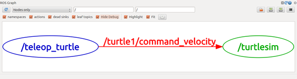

<!-- @import "[TOC]" {cmd="toc" depthFrom=1 depthTo=6 orderedList=false} -->

<!-- code_chunk_output -->

- [Beginner Level](#beginner-level)
  - [1. Installing and Configuring Your ROS Environment](#1-installing-and-configuring-your-ros-environment)
  - [2. Navigating the ROS Filesystem](#2-navigating-the-ros-filesystem)
  - [3. Creating a ROS Package](#3-creating-a-ros-package)
  - [4. Building a ROS Package](#4-building-a-ros-package)
  - [5. Understanding ROS Nodes](#5-understanding-ros-nodes)
  - [6. Understanding ROS Topics](#6-understanding-ros-topics)
  - [7. Understanding ROS Services and Parameters](#7-understanding-ros-services-and-parameters)
  - [8. Using rqt_console and roslaunch](#8-using-rqt_console-and-roslaunch)
  - [9. Using rosed to edit files in ROS](#9-using-rosed-to-edit-files-in-ros)
  - [10. Creating a ROS msg and srv](#10-creating-a-ros-msg-and-srv)
  - [11. Writing a Simple Publisher and Subscriber (node)](#11-writing-a-simple-publisher-and-subscriber-node)
  - [14. Writing a Simple Service and Client (node)](#14-writing-a-simple-service-and-client-node)
  - [17. Recording and Playing back data](#17-recording-and-playing-back-data)
  - [18. Getting started with roswtf](#18-getting-started-with-roswtf)

<!-- /code_chunk_output -->


# Beginner Level 

http://wiki.ros.org/ROS/Tutorials

## 1. Installing and Configuring Your ROS Environment

```shell
$ echo "source /opt/ros/melodic/setup.bash" >> ~./bashrc
```

这句话的意思是把引号中的指令加到 ~/.bashrc 这个脚本后面。
如果有多个 ROS 版本建议不要用这个指令。

```shell
$ source ~./bashrc
```

__It allows you to have access to the ROS commands.__

---

create and build a catkin workspace using the command: catkin_make.

```shell
$ mkdir -p ~/catkin_ws/src
$ cd ~/catkin_ws/
$ catkin_make
```

catkin_make 之后，当前 workspace 下除了 src 又得到了 build 和 devel 两个文件夹，在 devel 文件夹中又会有几个 setup.*sh 文件。
If you want to overlay this workspace on top of your environment:

```shell
$ source devel/setup.bash
```

__catkin is the recommended way to organize and build your ROS code.__

## 2. Navigating the ROS Filesystem

Filesystem consists of:
* Packages: software organization unit. (contain libraries, executables, scripts...)
* Manifests (package.xml): a description of a package

---

Filesystem 的常用工具

```shell
$ rospack find [package_name]
$ roscd [locationname[/dubdir]]
$ rosls [locationname[/subdir]]
```

__ROS tools will only find ROS packages that are within the directories listed in your ROS_PACKAGE_PATH.__

## 3. Creating a ROS Package

__catkin package: package.xml + CMakeLists.txt + its own folder.__
比如说 FAST_LIO 应该是一个 catkin package。

---

The recommended method of working with catkin packages is using a catkin workspace: __../catkin_ws/src/package_1.__
也就是说 workspace 的 src 里可以有很多的 package，每个里面都有 package.xml + CMakeLists.txt。

---

```shell
$ catkin_create_pkg <package_name> [depend1] [depend2] [depend3]
```

自动产生 package.xml，这些 dependencies 会被记录到 package.xml 里。

---

build the packages in the catkin_ws:

```shell
$ catkin_make.
```

__catkin_make combines the calls to cmake and make in the standard CMake workflow.__
catkin_make 和 catkin build 好像不能混用，catkin build 好像是独立操作？

---

显示创建包时的“依赖项”和“依赖项的依赖项”。

```shell
$ rospack depends1 [package_name]
$ rospack depends [package_name]
```

---

a package.xml is made up of:
* description tag: 描述包
* maintainer tags: 维护者信息
* license tags: 许可证信息
* dependencies tags
* and so on...

## 4. Building a ROS Package

当完成 catkin_make 之后，会自动在 workspace 下生成：
* build
* __devel: executalbes 和 libraries 被放到这儿，以便 install packages 时使用？__
* src (catkin_make 之前就有)

## 5. Understanding ROS Nodes

graph concepts:
* __Nodes:__ A node is an __executable file whithin a ROS package__. Nodes use a ROS client library (Client Libraries 允许不同语言的 nodes 之间通信) to communicate with other nodes. Nodes can also provide or use a Service.
* __Messages:__ ROS data type used when subscribing or publishing to a topic.
* __Topics:__ Nodes can publish messages to a topic as well as subscribe to a topic to receive messages.
* __Master:__ Name service for ROS (__i.e. helps nodes find each other__)
* __rosout:__ ROS equivalent of stdout/stderr
* __roscore:__ Master + rosout + parameter server. roscore is the first thing you should run when using ROS. 在 rosrun 节点之前先应该 `$ roscore`。

---

```shell
$ rosnode list  # 查看当前正在运行的节点
$ rosnode info /rosout
$ rosnode ping [node_name]
```

---

```shell
$ rosrun [package_name] [node_name]  # 运行一个节点
$ rosrun turtlesim turtlesim_node __name:=my_turtle  # 可以更改节点名字
```

## 6. Understanding ROS Topics

```shell
$ rosrun rqt_graph rqt_graph  # 生成节点和话题的动态图表
```



两个节点关于话题“command_velocity”在进行交互（发布和订阅）。

```shell
$ rosrun rqt_plot rqt_plot
```

---

|命令|含义|
|---|---|
|rostopic bw|display bandwidth used by topic|
|rostopic echo|print messages to screen|
|rostopic hz|display publishing rate of the topic
|rostopic list|print information about active topics
|rostopic pub|publish data to topic
|rostopic type|print topic type

```shell
$ rostopic echo /turtle1/cmd_vel  # 和上图的绿色节点订阅一样的信息
```

```shell
$ rostopic pub [topic] [msg_type] [args]
$ rostopic pub -1 /turtle1/cmd_vel geometry_msgs/Twist -- '[2.0, 0.0, 0.0]' '[0.0, 0.0, 1.8]'
# -1 代表只发布一条信息就退出。-- 告诉 option parser 之后的语句并不是 option。
$ rostopic pub /turtle1/cmd_vel geometry_msgs/Twist -r 1 -- '[2.0, 0.0, 0.0]' '[0.0, 0.0, 1.8]'
# -r 1 代表以 1 Hz 的频率发布消息（这样就能持续移动）。
```

---

```shell
$ rosmsg show [msg_type]
```

## 7. Understanding ROS Services and Parameters

Services are another way that nodes can communicate with each other. Services allow nodes to send a request and receive a response.

---

rosservice can easily attach to ROS's client/service framework with services.

|命令|含义|
|---|---|
|rsoservice list|print information about active services|
|rosservice call|call the service with the provided args|
|rosservice type|print service type|
|rosservice find|find services by service type|
|rosservice uri|print service ROSRPC uri|

```shell
$ rosservice call [service] [args]
$ rosservice call /clear  # 无参数，清空背景
$ rosservice call /spawn 2 2 0.2 ""  # 生成小乌龟
```

```shell
$ rossrv show [service_type]
$ rosservice type /spawn | rossrv show  # 一种组合命令
```

---

rosparam allows you to store and manipulate data on the ROS Parameter Server.

|命令|含义|
|---|---|
|rosparam set|set parameter `$ rosparam set /background_r 150`|
|rosparam get|get parameter `$ rosparam get /background_g`|
|rosparam load|load parameters from file `$ rosparam load [file_name] [namespace]`|
|rosparam dump|dump parameters to file `$ rosparam dump [file_name] [namespace]`|
|rosparam delete|delete parameter|
|rosparam list|list parameter names|

## 8. Using rqt_console and roslaunch

__rqt_console attaches to ROS's logging framework to display output from nodes.__ rqt_logger_level allows us to change the verbosity level (DEBUG, INFO, WARN, ERROR) of nodes as they run. __They are used for debugging.__

```shell
$ rosrun rqt_console rqt_console
$ rosrun rqt_logger_level rqt_logger_level
```

---

__roslaunch is used for starting many nodes at once.__ roslaunch command automatically looks into the passed package and detects available launch files.

```shell
$ roslaunch [package] [filename.launch]
```

```xml{.line-numbers}
<launch>  # launch tag to identify the file as a launch file

    <group ns="turtlesim1">  # namespace to avoid name conflicts
        <node pkg="turtlesim" name="sim" type="turtlesim_node"/>
    </group>

    <group ns="turtlesim2">
        <node pkg="turtlesim" name="sim" type="turtlesim_node"/>
    </group>

    <node pkg="turtlesim" name="mimic" type="mimic">
        <remap from="input" to="turtlesim1/turtle1"/>  # 从 1 订阅 topic
        <remap from="output" to="turtlesim2/turtle1"/>  # 向 2 发布 topic
    </node>

</launch>
```

## 9. Using rosed to edit files in ROS

rosed allows you to directly edit a file within a package by using the package name. __背后的默认编辑器是 vim。__

```shell
$ rosed [package_name] [filename]
```

## 10. Creating a ROS msg and srv

在 package 下新建和 src 并列的两个文件夹 msg 和 srv。

---

msg: msg files are simple text files that describe the fields of a ROS message. They are used to generate source code for messages in different languages.
srv: an srv file describes a service. It is composed of two parts: a request and a response. 如下：

```xml
int64 a
int64 b
---
int64 sum
```

---

```shell
$ rosmsg -h
$ rossrv -h
```

## 11. Writing a Simple Publisher and Subscriber (node)

create src/talker.cpp files within the package.

```c++{.line-numbers}
#include "ros/ros.h"
#include "std_msgs/String.h"  // 这是一个从 String.msg 自动生成的头文件
#include <sstream>

int main(int argc, char **argv)
{
    // 第三个参数是节点名。
    // 使用 ROS system 前必须进行初始化。
    ros::init(argc, argv, "talker");

    // NodeHandle is the main access point to communications with the ROS system.
    // 初次创建句柄会对节点初始化，最后一次销毁句柄会消除节点正在使用的所有资源。
    ros::NodeHandle n; 
    
    // advertise 告诉 ROS 想要发布 topic "chatter"
    // This invokes a call to the ROS master node, which keeps a registry of who is publishing and who is subscribing.
    // 进而 master node 会通知所有订阅 "chatter" 的节点和本节点建立连接。
    // 这里的参数 1000 specifies how many messages to buffer up before throwing some away. 
    // Publisher object 帮助发布消息，当它全部被销毁后，topic 自动 unadvertise。
    ros::Publisher chatter_pub = n.advertise<std_msgs::String>("chatter", 1000); 
    
    ros::Rate loop_rate(10);  // 控制循环的频率为 10 Hz
    int count = 0;  // 记录发布的信息数量
    while (ros::ok())  // 比如 Ctrl-C 会让 ros::ok() 返回 false
    {
        std_msgs::String msg;
        std::stringstream ss;
        ss << "hello world " << count;
        msg.data = ss.str();
        
        ROS_INFO("%s", msg.data.c_str());  // 会在终端显示
        chatter_pub.publish(msg);
        
        ros::spinOnce();  // 消息回调处理
        loop_rate.sleep();
        ++count;
    }
    return 0;
}
```

---

create src/listener.cpp files within the package.

```c++{.line-numbers}
#include "ros/ros.h"
#include "std_msgs/String.h"

// 收到 message 后的回调函数。收到以共享指针传递的消息。
void chatterCallback(const std_msgs::String::ConstPtr& msg)
{
    ROS_INFO("I heard: [%s]", msg->data.c_str());
}

int main(int argc, char **argv)
{
    ros::init(argc, argv, "listener");
    ros::NodeHandle n;
    
    // subscribe 告诉 ROS 想要订阅 topic "chatter"，message 会被传入回调函数。
    // 这里的参数 1000 specifies how many messages to buffer up before throwing some away.
    // Subscriber object (sub) must be held on to，当它全部被销毁后，自动unsubscribed。
    ros::Subscriber sub = n.subscribe("chatter", 1000, chatterCallback);
    
    ros::spin();  // spin，等待 message 传入。
    return 0;
}
```

---

modify the CMakeLists.txt. And finally run: `catkin_make`.

## 14. Writing a Simple Service and Client (node)

Here we'll create the service ("add_two_ints_server") node which will receive two ints and return the sum.

```c++{.line-numbers}
#include "ros/ros.h"
#include "beginner_tutorials/AddTwoInts.h"  // 自动生成自先前创建的 srv 文件

bool add(beginner_tutorials::AddTwoInts::Request &req,
    beginner_tutorials::AddTwoInts::Response &res)
{
    res.sum = req.a + req.b;
    ROS_INFO("request: x=%ld, y=%ld", (long int)req.a, (long int)req.b);
    ROS_INFO("sending back response: [%ld]", (long int)res.sum);
    return true;
}

int main(int argc, char **argv)
{
    ros::init(argc, argv, "add_two_ints_server");
    ros::NodeHandle n;
    
    ros::ServiceServer service = n.advertiseService("add_two_ints", add);
    ROS_INFO("Ready to add two ints.");
    
    ros::spin();
    return 0;
}
```

---

Create the src/add_two_ints_client.cpp file within the package.

```c++{.line-numbers}
#include "ros/ros.h"
#include "beginner_tutorials/AddTwoInts.h"
#include <cstdlib>

int main(int argc, char **argv)
{
    ros::init(argc, argv, "add_two_ints_client");
    if (argc != 3)
    {
        ROS_INFO("usage: add_two_ints_client X Y");
        return 1;
    }
    ros::NodeHandle n;

    ros::ServiceClient client = 
        n.serviceClient<beginner_tutorials::AddTwoInts>("add_two_ints");
    
    beginner_tutorials::AddTwoInts srv;
    srv.request.a = atoll(argv[1]);
    srv.request.b = atoll(argv[2]);
    if (client.call(srv))
    {
        ROS_INFO("Sum: %ld", (long int)srv.response.sum);
    }
    else
    {
        ROS_ERROR("Failed to call service add_two_ints");
        return 1;
    }
    return 0;
}
```

---

modify the CMakeLists.txt. And finally run: `catkin_make`.

## 17. Recording and Playing back data

```shell
$ rosbag record -a
$ rosbag info <your_bagfile>
$ rosbag play -r 2 <your_bagfile>
```

## 18. Getting started with roswtf

roswtf examines your system to try and find problems.


