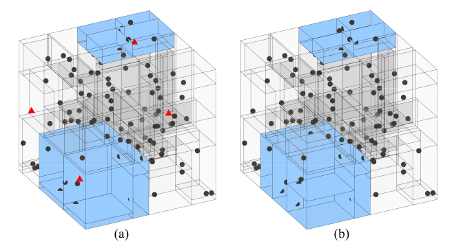
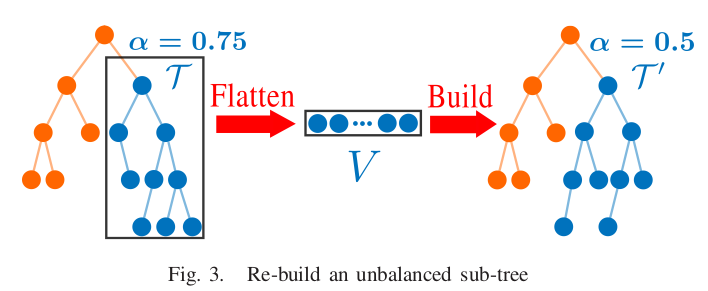

<!-- @import "[TOC]" {cmd="toc" depthFrom=1 depthTo=6 orderedList=false} -->

<!-- code_chunk_output -->

- [kd-Tree](#kd-tree)
- [ikd-Tree](#ikd-tree)
- [ikd-Tree 源码](#ikd-tree-源码)

<!-- /code_chunk_output -->



## kd-Tree

https://zhuanlan.zhihu.com/p/529487972

kd-Tree 结构中一个 node 需要承载的 __必要信息__ 有：

```c++
template <typename PointType>
TreeNode {
    TreeNode* father_;       // 父节点
    TreeNode* left_child_;   // 左子节点
    TreeNode* right_child_;  // 右子节点
    PointType point_data_;   // 自身数据
    int partition_axis_;     // 所在层的划分维度
    float partition_value_;  // 划分值 (not necessary)
};
```

__划分轴的选择__ 有两种常见策略：
1. 各维坐标轴轮流作为划分轴，比如第一层选 X 轴，第二层选 Y 轴，第三层又选 X 轴……
2. 始终选择分布最分散的轴作为划分轴。

kd-Tree 的 __搜索__ 也有两种常见策略（显然搜索效率与 kd-Tree 的深度有关）：
1. k 近邻搜索（__kNN__, k Nearest Neighbor）：从根节点开始往下搜索，在每一个节点处，计算节点和查询点的距离（将该距离放入一个排序队列中），然后根据节点的划分轴和划分值判断下一步是往左子树走还是右子树走，并在相应子节点重复上述过程，直至到达叶子节点，从排序队列获取前 k 个近邻即可。
2. 和有范围限制的 k 近邻搜索（__ranged-kNN__）：kNN 存在一个问题，包含距离更近的节点的子树可能会被提前剪枝。ranged-kNN 提出，某子树可以被剪枝的必要条件是，该子树所代表的空间与目标解空间无交叉。

再额外提一下 __删除__：
因为删除一个中间节点意味着该节点下方的所有节点都要重新构建 subtree，因此删除是一个很低效的操作。因此，所有的增量式 kd-Tree 结构，基本都会采用 __lazy delete 策略__：也就是删除一个节点时，先将其标记为删除，被标记为删除的节点在 kNN 搜索时会被跳过，但在树形结构中它还是存在的。只有当 tree 结构被彻底重构时（低频），才会借机真的把这些节点从 tree 结构中拿掉。

很多 SLAM 方案都需要用 kd-Tree 来维护一个动态的 local map，因此必然需要不断地插入新点，并删除过远过旧的点。但这些操作会导致 kd-Tree 的平衡性遭到破坏，即导致整个 kd-Tree 的 __深度不均衡__。最直接的影响就是 __搜索效率的下降__，ikd-Tree 应运而生。

## ikd-Tree

https://zhuanlan.zhihu.com/p/529926254

SLAM 中 __期望的 kd-Tree__：
1. 支持 local map 随着 pose 移动 -> 高效地动态增删
2. 支持的高效 kNN 搜索 -> 能够始终保持 tree 的平衡，做到动态 re-balance
3. 点无需太过稠密 -> 最好自带体素降采样功能

ikd-Tree __数据结构__：

```c++
TreeNode {
    PointType pointData;
    TreeNode* leftChild,* rightChild;
    int partitionAxis;
    int treeSize;          // 当前 tree 中所有节点的数量
    int invalidNum;        // 当前 tree 中被标记为删除的节点的数量
    bool deleted;          // 当前节点是否被标记为删除
    bool treeDeleted;      // 当前 tree 是否被标记为删除
    CuboidVertices range;  // 当前 tree 张成的 cuboid 空间，用于 ranged-kNN 剪枝加速
};
```

ikd-Tree 有两条 __平衡性判据__：

1. $\alpha_{balanced}$ 是最大能容忍一个 subtree 的左右两侧有多不平衡，否则就会被执行重构
2. $\alpha_{deleted}$ 是最多能容忍一个 subtree 中有多大比例被标记为删除的节点，否则就会被执行重构

ikd-Tree 的 __再平衡算法（并行线程）__：

如果需要重建的 subtree 规模很大，重建时间花销不可忽略，此时在主线程中执行重建，就会导致 ikd-Tree 一直被占用，外部的 SLAM/LIO 算法无法访问 ikd-Tree。
针对这种情况，ikd-Tree 采取了一种双线程策略：耗时的重建过程在额外的线程中执行，__主线程仍旧对外提供查询和增删服务__。其中对“正在重建的 subtree”的增删操作会被额外缓存到一个叫作 OperationLogger 的容器中；待完成重建后，会从 OperationLogger 把增删操作补到新的 subtree 上。



ikd-Tree __批量删除节点__：

box-wise delete 结合了 range 信息和 lazy delete 策略。输入一个立方体区域，ikd-Tree 会删除这个区域内的所有点。

ikd-Tree __插入节点与同步降采样__：

首先将整个空间体素化，并明确新点落入哪个体素（目标体素）；然后向 ikd-Tree 查询目标体素内是否已经有点以及有哪些点；将已有点和新点一起排序，保留离体素中心最近的那个点。

## ikd-Tree 源码


