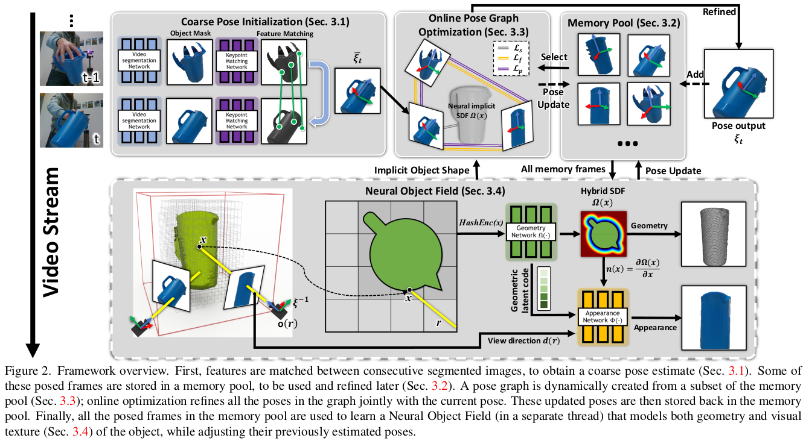
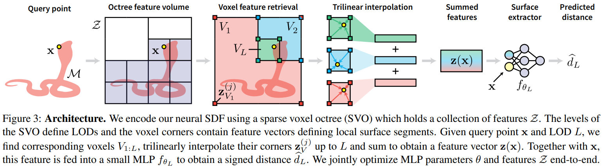
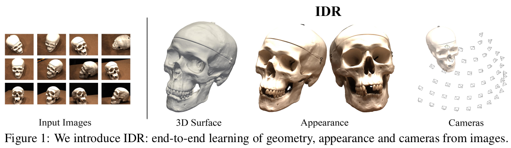
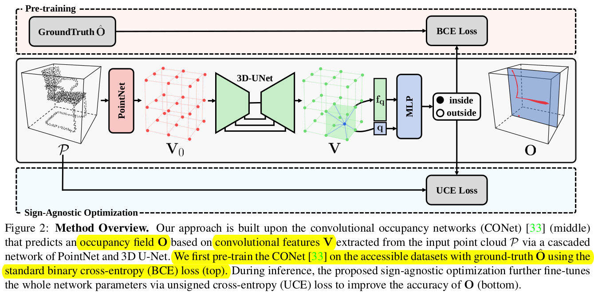

<!-- @import "[TOC]" {cmd="toc" depthFrom=1 depthTo=6 orderedList=false} -->

<!-- code_chunk_output -->

- [3D Reconstruction](#3d-reconstruction)
  - [BundleSDF: Neural 6-DoF Tracking and 3D Reconstruction of Unknown Objects](#bundlesdf-neural-6-dof-tracking-and-3d-reconstruction-of-unknown-objects)
  - [Neural Geometric Level of Detail: Real-time Rendering with Implicit 3D Shapes](#neural-geometric-level-of-detail-real-time-rendering-with-implicit-3d-shapes)
  - [Multiview Neural Surface Reconstruction by Disentangling Geometry and Appearance](#multiview-neural-surface-reconstruction-by-disentangling-geometry-and-appearance)
  - [SA-ConvONet: Sign-Agnostic Optimization of Convolutional Occupancy Networks](#sa-convonet-sign-agnostic-optimization-of-convolutional-occupancy-networks)

<!-- /code_chunk_output -->

## 3D Reconstruction

--- 

### BundleSDF: Neural 6-DoF Tracking and 3D Reconstruction of Unknown Objects

__NVIDIA | CVPR 2023__

Abstract:

* 单目 RGBD 相机；
* 接近实时（10 Hz）；
* 6-DoF pose tracking + 3D reconstruction of an unknown object；
* 能够应对“遮挡、反射、缺乏纹理、缺乏几何特征、突然抖动”等情况。

3.1 Coarse Pose Initialization:

__由上一帧的物体位姿粗略估计当前帧的物体位姿。__
首先用 video segmentation network 获取 mask；再用 keypoint matching network 提取特征点的描述子；最后用 RANSAC 估计位姿。

3.2 Memory Pool:

__记忆池用于保存关键帧信息；关键帧可以用来优化 3.1 节得到的粗略位姿。__
* 当某一帧与记忆池中的关键帧姿态差异较大时，该帧被加入到记忆池中。
* 每个关键帧都关联一个 bool 值。一开始 bool 值为 false，代表该帧的位姿需要在 pose graph 中被优化；当该位姿在 neural object field 中第一次被优化，则 bool 值置为 true，该位姿从此只在 neural object field 中被优化。

3.3 Online Pose Graph Optimization:

__每次从记忆池中选择姿态最接近的 K 个关键帧，优化当前帧的物体位姿。__
* 用 Gauss-Newton 法最小化优化方程。
* Lf 项代表匹配的特征点之间的位置误差。
* Lp 项代表特征点重投影后的点面误差。
* Ls 项代表特征点到 implicit object shape 的误差。

3.4 Neural Object Field:

__用记忆池中的关键帧学习 neural object field。__
* object field 用两个映射来表示：geometry function + appearance function。
* 这两个映射分别用两个神经网络在线学习。

---

### Neural Geometric Level of Detail: Real-time Rendering with Implicit 3D Shapes

__NVIDIA | CVPR 2021__

Abstrac

__给定从不同角度观测某模型的点云数据，本文用神经网络训练了该模型的 Signed Distance Functions (SDFs)。__
本文的核心思想在于：简化网络模型 $f_\theta$，将计算复杂度转移到 shape feature vector (z) 问询上。sparse voxel octree (SVO) 的每个体素角点都训练了一个 z。SVO 越深，z 包含的细节信息越丰富。不同深度对应的网络参数 $\theta$ 不同。

3.2. Neural Geometric Levels of Detail

输入一个 3D 点和 SVO 深度 L；每层体素都三线性插值获取该点的特征 z；将不同深度的 z 相加，输入参数为 $\theta_L$ 的网络；得到 $d_L$。

3.4. Interactive Rendering

给定一条射线 r 和 SVO 深度 L；先在 SVO 上搜索所有与 r 相交的体素，记为集合 V；在 V 中迭代使用 sphere tracing，寻找 r 与模型的交点。

---

### Multiview Neural Surface Reconstruction by Disentangling Geometry and Appearance

__NeurIPS 2020__

Abstrac

输入物体在不同相机视角（已知 pose）下的 RGB 图象，训练 3D geometry 和 image renderer。

3.4 Loss

__利用 SDF 估计网络对每个像素作 sphere tracing，寻找像素与模型的 3D 交点，计算 mask loss；将交点信息输入 renderer 后，计算 RGB loss；为了避免 SDF 处处为零，在空间中均匀采样，计算 IGR loss。__
所谓 IGR loss，出自文章 Implicit Geometric Regularization for Learning Shapes (ICML 2020)。这篇文章输入一组 3D 点云，学习模型的 SDF。

---

### SA-ConvONet: Sign-Agnostic Optimization of Convolutional Occupancy Networks

__Alibaba DAMO Academy | ICCV 2021__

3.1 Overview

__输入一片点云，估计 occupancy field O。__
1. 本算法有三个优点：可移植于大场景，可通用于新形状，可适用于原始点云。
2. 本算法包含两阶段：Pre-training 和 Sign-Agnostic Optimization。第一阶段网络参数提前训练好，学习 local shape priors 和 signed field initialization。

3.2 Convolutional Occupancy Fields Pre-training

1. 首先用 PointNet 学习点云特征；再用 average pooling 将同一体素内的点云特征翻译为 V0；最后用 3D-UNet 整合不同尺度的 V0，得到体素特征 V。
2. 对某一坐标为 q 的空间点，三线性插值得到特征 fq；将 q 与 fq 输入 occupancy decoder 预测 inside 和 outside 的概率。

3.3 Sign-Agnostic Implicit Surface Optimization

__为了更好地理解环境中的新形状。__

