<!-- @import "[TOC]" {cmd="toc" depthFrom=1 depthTo=6 orderedList=false} -->

<!-- code_chunk_output -->

- [Sampling-based path planning](#sampling-based-path-planning)
  - [PRM](#prm)
  - [Voronoi](#voronoi)
  - [RRT](#rrt)
  - [RRT*](#rrt-1)
- [Search-based path planning](#search-based-path-planning)
  - [Dijkstra](#dijkstra)
  - [A*](#a)
  - [D*](#d)
  - [当启发函数更加复杂...](#当启发函数更加复杂)
- [Kinodynamic path planning](#kinodynamic-path-planning)
  - [Hybrid A*](#hybrid-a)
  - [Kinodynamic RRT*](#kinodynamic-rrt)
  - [Hybrid A* implementation](#hybrid-a-implementation)
- [Machine Learning path planning](#machine-learning-path-planning)

<!-- /code_chunk_output -->

路径规划分类:
1. 静态结构化环境下的路径规划。
2. 动态已知环境下的路径规划。
3. 动态不确定环境下的路径规划。

## Sampling-based path planning

### PRM

__Probabilistic Roadmaps for Path Planning in High-Dimensional Configuration Spaces, 1996__

__原理：__

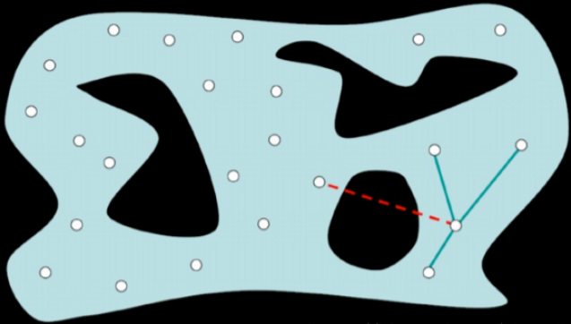

1. 在地图中随机采样，剔除与环境碰撞的采样点。
2. 每个点查询 K 近邻，建立连线，剔除与环境碰撞的连线。得到概率路线图。
3. 在概率路线图中应用 A* 算法，搜索最优路径。

### Voronoi

__原理：__

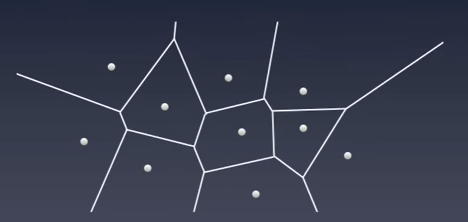

Voronoi Diagram 是一种空间分割算法。它通过一系列的种子节点将空间切分为许多子区域，每个子区域被称为一个 Cell。每个 Cell 中包含的都是距离当前种子节点距离最近的所有点，因此 Cell 的边界就是距离种子节点最远的点的集合。利用 Voronoi Diagram 的这个特性，将障碍物的边界当做种子节点，那么 Cell 的边界就是最大程度远离所有障碍物的安全行驶路径。

再在安全行驶路径上采样，应用 Dijkstra 算法等，搜索最优路径。

### RRT

__Rapidly-Exploring Random Trees: A New Tool for Path Planning, 1998__

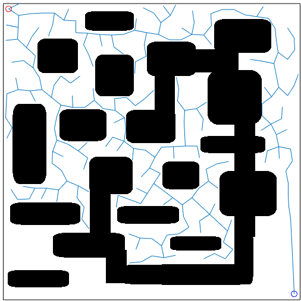

__原理：__

1. 每次循环中，首先在地图区域内生成一个采样点，该采样点有 50% 的几率是目标点，还有 50% 的几率是随机生成的。
2. 接着在 RRT 树上找到与这个采样点空间距离最接近的节点。这样一来，我们就可以找到一个由节点指向采样点，长度为预定义步长的新节点。
3. 得到新节点后，我们需要判断由原节点指向新节点的路径是否通畅。如果这条路径上有障碍物，或者新节点与 RRT 树上的原节点位置过于接近，那么我们就放弃这次搜索；如果没有，我们就接受。
4. 判断新节点与目标位置的空间距离是否小于距离阈值，如果小于，那么就完成搜索目标。

### RRT*

__Sampling-based Algorithms for Optimal Motion Planning, 2011__

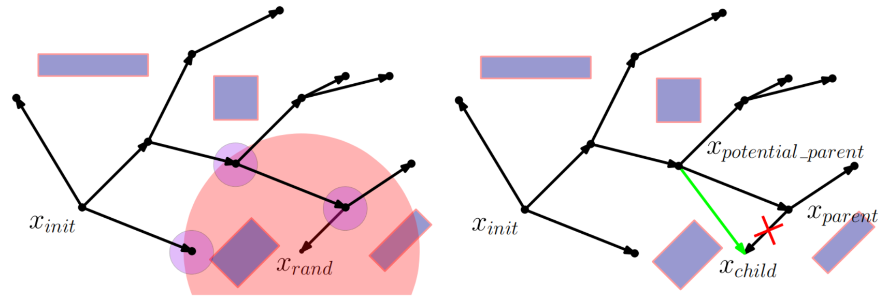

__原理：__

RRT 的改进版，$x_{rand}$ 不再取最近的节点为父节点，而是取使总代价最小的节点为父节点。
并且在一定范围内选择 $x_{rand}$ 的子节点，使子节点的总代价也最小。

## Search-based path planning

### Dijkstra

__A Note on Two Problems in Connexion with Graphs, 1959__

__原理：__

Dijkstra 算法是一种广度优先搜索算法，每到达一个节点就优先遍历该节点的所有相邻节点。当搜索完毕也就遍历了所有节点，因此其时间开销是很大的，尤其是在地图非常大的时候，其时间复杂度是不能接受的。

### A*

__A Formal Basis for the Heuristic Determination of Minimum Cost Paths, 1968__

__原理：__

Dijkstra 算法之所以时间开销大是因为穷举搜索。如果在搜索过程中利用一些合适的启发函数进行剪枝，就可以加速搜索。

搜索从节点 S 到节点 T 的路径。定义启发函数 $f'(n)=g'(n)+h'(n)$。其中 $g'(n)$ 是 S 到节点 n 的最短路径值，$h'(n)$ 是节点 n 到 T 的最短路经值。目标是找到最小的 $f'(n)$。

每一步搜索时，$g'(n)$ 已知，$h'(n)$ 需要估计。只要确保 $h'(n)$ 的估计值小于真实值，就可以安全地去除那些不可能产生最优解的分支。

__例子：__

https://blog.csdn.net/simon_world/article/details/42173351

### D*

__Optimal and Efficient Path Planning for Partially-Known Environments, 1994__

原理与 A* 相似，D* 的意思是：Dynamic A*。

__创新点：__

1. 从终点向起点搜索。
2. 动态更新损失地图。当环境障碍物不断变化时，其搜索最优路径的效率更高。

### 当启发函数更加复杂...

__A Receding Horizon Multi-Objective Planner for Autonomous Surface Vehicles in Urban Waterways, 2020__

__原理：__

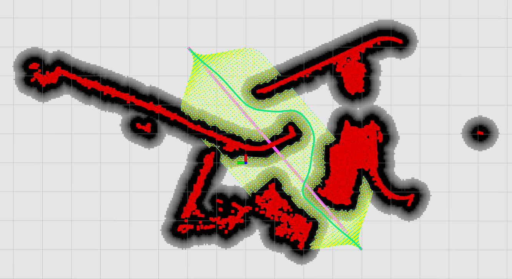

1. 已知环境中的 __障碍物__（红色部分）；考虑台车大小之后，可以计算出 __碰撞区域__（黑色部分）。
2. 启发函数定义三项 __代价__：期望与障碍物保持安全距离；期望少转弯；期望总路程尽可能的短。
3. 输入一条 __初始路径__（粉色线条）；在初始路径附近生成密度均匀的 __路径节点__（绿色栅格）；对路径节点构建 PRM __概率路线图__；遍历搜索使总代价最小的 __最优路径__（绿色线条）。

__代码难点在于：__ 如何由路径节点，遍历搜索得到最优路径。
__解决思路是：__ 将两两邻接的路径节点看作是一条 edge，先分别计算每段 edge 的代价；再利用优化的思想，查找 edge 之间的最优组合，作为最优路径。

## Kinodynamic path planning

### Hybrid A*

__Practical Search Techniques in Path Planning for Autonomous Driving, 2008__

__原理：__

首先使用 Hybrid-State A* 规划出符合小车运动学的粗路径。
再使用共轭梯度法对粗路径进行优化。

__Hybrid-State A* Search__

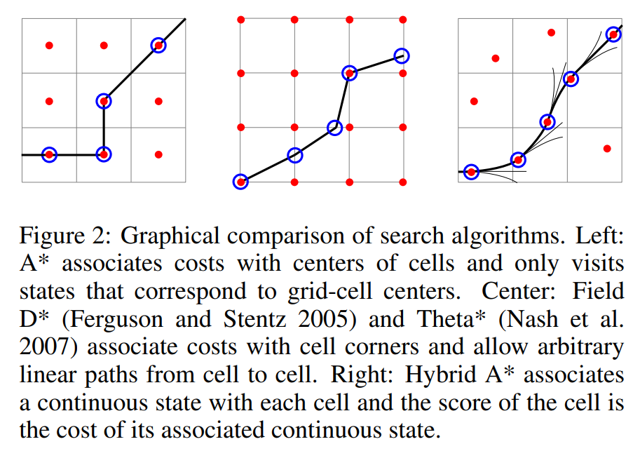
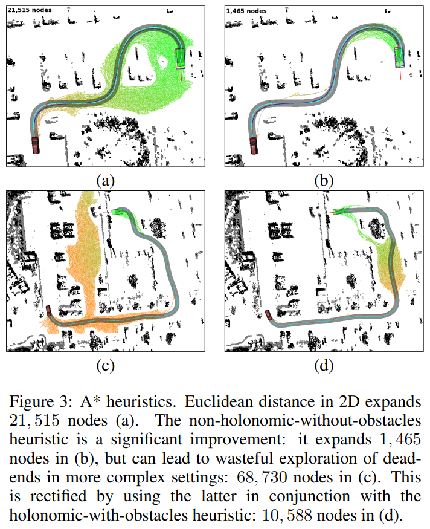

fig2：节点之间的连线不再是线段，而是曲线，这更加符合小车运动学规律。

fig3：两种启发函数：non-holonomic-without-obstacles (b,c) 和 holonomic-with-obstacles (d)。前者保证了自动泊车的朝向；后者考虑了环境中的障碍物。

另外一个小技巧是利用 RS 曲线进行简化计算。大致思路是在拓展一些节点时，通过计算当前节点的 RS 曲线来生成一条最优路径。然后检查该路径是否与障碍物相碰，如果没有碰撞，就执行该路径。

__Path-Cost Function Using the Voronoi Field__

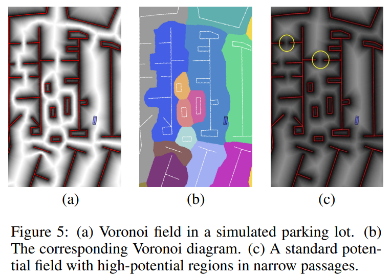

fig 5：常规的势场在狭窄的通道上仍然存在较高的势能，因此较难通过狭窄的通道 (c)。而维诺势场会按照通道的宽度进行比例缩放 (a)。

__Local Optimization and Smoothing__

Hybrid-State A* Search 获得的路径往往不够平滑，对其进行后处理。

损失函数包括四项：Voronoi 势场；到障碍物的距离；曲率；路径尽可能平滑。

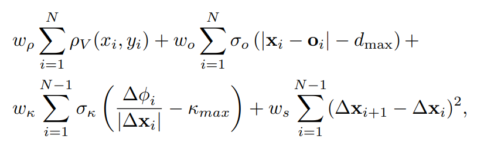

采用共轭梯度下降法最小化该损失函数。

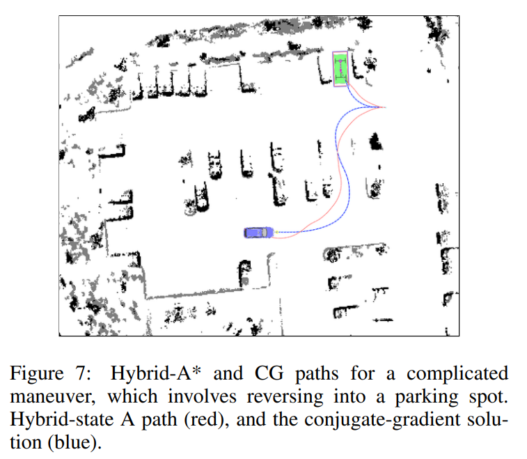

### Kinodynamic RRT*

__Kinodynamic RRT*: Asymptotically optimal motion planning for robots with linear dynamics, 2013__

__原理：__

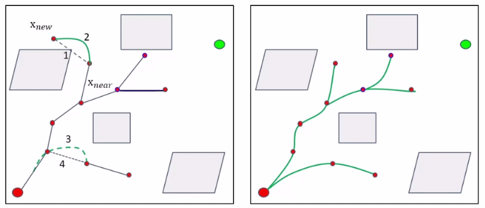

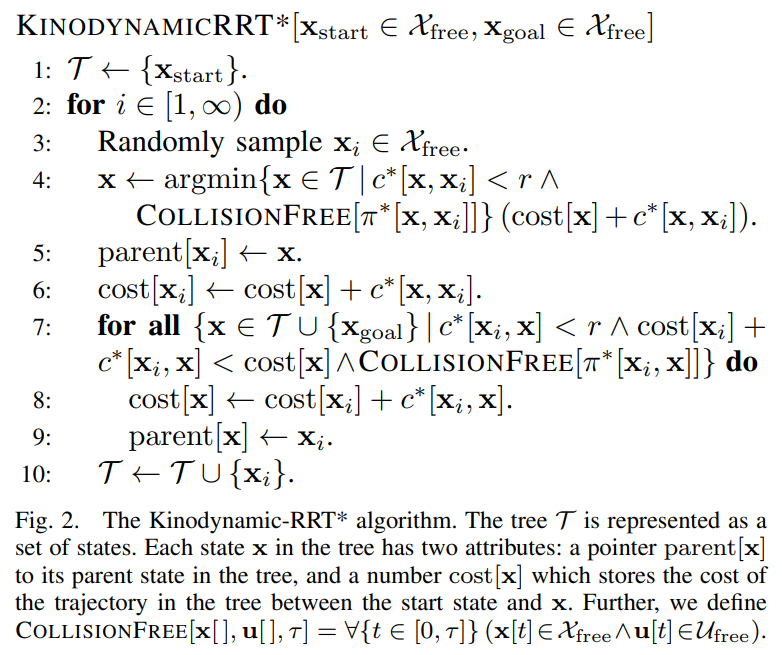

RRT* 中使用折线连接节点的方法不符合小车运动学。Kinodynamic RRT* 使用曲线连接节点。
曲线的生成方法参考论文：__F. Lewis, V. Syrmos. Optimal Control. John Wiley & Sons, 1995.__

每次生成新节点后，同时生成新节点与目标点之间的曲线，判断该曲线是否与障碍物相碰，若不相碰则保留。

### Hybrid A* implementation

__Path Planning in Unstructured Environments : A Real-time Hybrid A* Implementation for Fast and Deterministic Path Generation for the KTH Research Concept Vehicle, 2016__

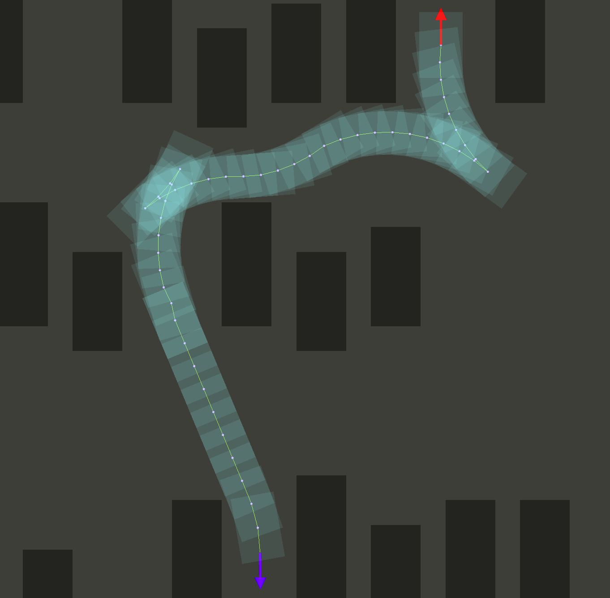

## Machine Learning path planning

