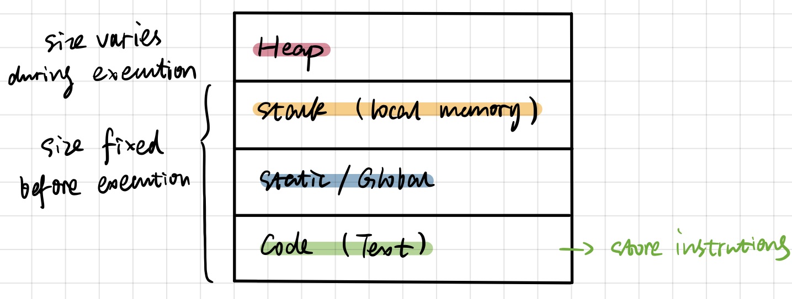
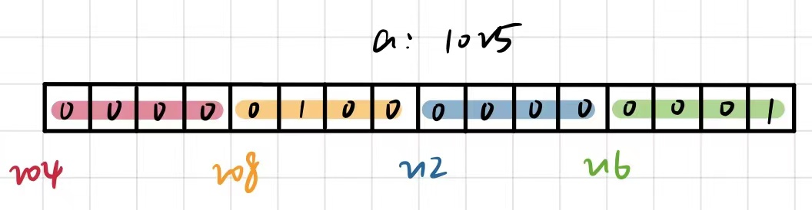
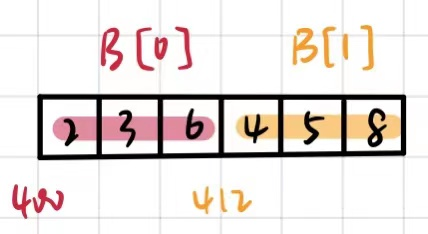

<!-- @import "[TOC]" {cmd="toc" depthFrom=1 depthTo=6 orderedList=false} -->

<!-- code_chunk_output -->

- [basic](#basic)
- [2D array](#2d-array)
- [dynamic memory (Heap)](#dynamic-memory-heap)
- [函数指针](#函数指针)

<!-- /code_chunk_output -->

https://www.youtube.com/watch?v=zuegQmMdy8M

## basic



__int 和 char：__



```c++ {.line-numbers}
int a = 1025;
int* p = &a;          // p = 204
char* pc = (char*)p;  // pc = 204
int** q = &p;         // *q = 204
```

__函数传址：__

```c++ {.line-numbers}
void increment(int *p) {
    *p = (*p) + 1;
}
int main() {
    int a = 1025;
    increment(&a);
}
```

__array:__

```c++ {.line-numbers}
int SumOfElements(int A[]) {  // (int A[]) equals to (int* A)
    // ...
}
int main() {
    int A[] = {1,2,3,4,5};
    int total = SumOfElements(A);  // (A) equals to (&A[0]). 传递起始地址
}
```

__string:__

```c++ {.line-numbers}
char c[8];  // store "NEAL". needs the end mark "\0", space >=5.
c[0]='N'; c[1]='E'; c[2]='A'; c[3]='L'; c[4]='\0';
/* 等价于
char c[8] = "NEAL";
*/
```

```c++ {.line-numbers}
int main() {
    /* 案例一*/
    char c[8] = "NEAL";  // string get stored in the space for array.
    char *pc = &c；
    /* 案例二*/
    char *pc2 = "NEAL";  // string get stored as compile time constant.
    // 不能改值。
}
```

## 2D array



```c++ {.line-numbers}
int B[2][3];
int (*p)[3] = B;  // return a pointer to 1D array of 3 integers.

// B or &B[0] or *B or B[0] or &B[0][0] = 400.
// B[0] return a pointer to a integer.

// *(B+1)+2 or B[1]+2 or &B[1][2] = 420.

// *(*(B+1)+1) or *(B[1]+1) or B[1][1] = 5.
```

```c++ {.line-numbers}
void Func(int B[][3]) {  // (int B[][3]) equals to (int (*B)[3])
    // ...
}
int main() {
    int B[2][3];
    Func(B);
}
```

## dynamic memory (Heap)

__c style:__

```c++ {.line-numbers}
int *p;  // goes on stack

/* 方法一*/
p = (int*)malloc(3*sizeof(int));  // goes on heap
/* 方法二*/
p = (int*)calloc(3, sizeof(int));  // calloc 会将所有元素初始化 0。

int *p2 = (int*)realloc(p, 6*sizeof(int));  // 此时 p 与 p1 指向同一片地址。
free(p);
```

```c++ {.line-numbers}
int *p2 = (int*)realloc(NULL, 6*sizeof(int));  // 等价于 malloc。
int *p2 = (int*)realloc(p, 0);                 // 等价于 free(p)。
```

__c++ style:__

```c++ {.line-numbers}
int *p;
p = new int;
*p = 10;
delete p;

p = new int[20];
delete[] p;
```

__函数返回传址：__

```c++ {.line-numbers}
int* Func(int a, int b) {
    int* c = (int*)malloc(sizeof(int));
    *c = a + b;  // heap 的内存一直存在。
    return c;
}
int main() {
    int a = 3, b = 4;
    int* p = Add(a, b);
}
```

## 函数指针

```c++ {.line-numbers}
int Add(int a, int b) {
    return a+b;
}
int main() {
    int (*p)(int, int);
    p = &Add;           // or p = Add;
    int c = (*p)(2,3);  // or c = p(2,3);
}
```


