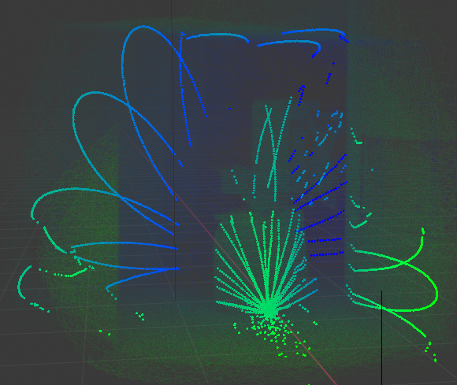
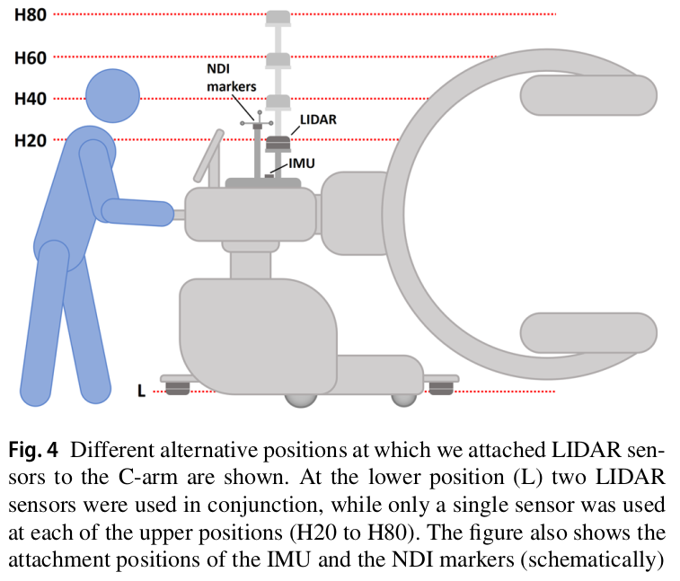
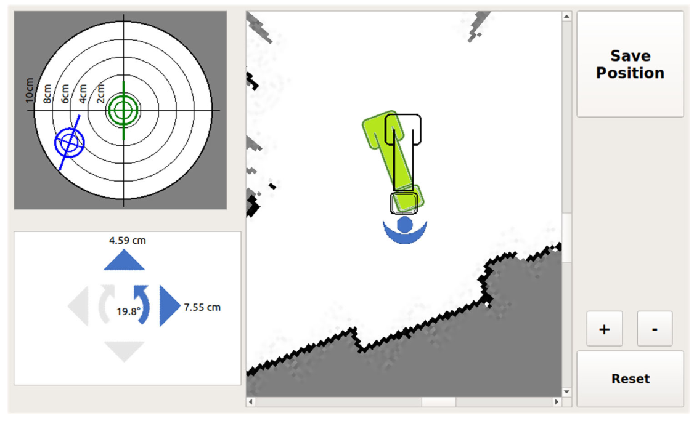

### 点云获取

考虑到待检测目标 Trocar 的几何尺寸较小，因此采用静态扫描的方式收集点云数据。

### 滤波

观察点云数据，发现 edge effect 现象非常明显，因此首先进行滤波处理。

__滤波前后效果对比：__


```python {.line-numbers}
# pseudo code
将原始点云的 x 轴坐标（深度方向）归一化到 1
将归一点云按照 yz 轴相对位置关系构建 KD 树
for point_now : 原始点云
    在 KD 树中寻找 point_now 的 8 个最近邻
    for point_i : 最近邻
        if (point_now.x-point_i.x > 0.05)
            认为 point_now 是噪声
            continue
从原始点云中剔除噪声点
```

### 点云分割

接下来的目标是从一整片点云中提取属于 Trocar 的点云。
之前干过类似的事情：用 VoteNet 提取属于台车的点云。但是，由于 Trocar 的几何尺寸较小，自由度较复杂，点云噪声较多，不适合用模型来分割点云。

__点云提取效果：__


```python {.line-numbers}
# pseudo code
将原始点云按照 xyz 轴相对位置关系构建 KD 树
利用 KD 树，估计原始点云的法向量 normal
定义点云类集合 C 用于储存点云类
定义点云集合 Q 用于储存点云
for point_now : 原始点云
    if point_now in C || point_now in Q
        continue
    将 point_now 加入 Q
    for point_neighbor in Q
        在原始点云中搜索 point_neighbor 的近邻点（dis < 0.1）
        for point_i in 近邻点
            if point_i in C || point_i in Q
                continue
            if abs(point_neighbor.normal-point_i.normal) < 30deg
                将 point_i 加入 Q
    将 Q 加入 C
    将 Q 清空
# 代码中还使用了一个小策略：首先计算原始点云的质心，将高度位于质心以下的点云归为同一类。
```

### 计算 RCM 点与 Trocar 朝向

- 粗略地将高度最低的点视作 RCM 点。
- 粗略地将特征值最大的特征向量视作 Trocar 朝向。

---

### 台车追踪（闭环控制的子任务）

VoteNet 文中指出，该网络对于 4w 大小点云的处理速度为 100ms。
因此，考虑每 100ms 收集一批点云数据，估计台车位姿。



__精度：__

共采集了 50 批点云数据估计位姿，与整个场景的点云数据估计出来的位姿进行比较：
- 位置误差：0.06015m
- 姿态误差：1.421度

__速度：__

在笔记本上的处理速度约 2-3s/帧。

---

### RAY-POS: a LIDAR-based assistance system for intraoperative repositioning of mobile C-arms without external aids

__International Journal of Computer Assisted Radiology and Surgery 2022 (3.421)__
__慕尼黑工业大学 Research Group MITI__

C-arm 在手术中有时需要反复推到同一位姿，对病人进行扫描。
于是本文利用 2D 激光雷达 SLAM 技术，在 C-arm 第一次到达目标位姿进行扫描时，记录下该目标位姿；当手术过程中需要再次使用 C-arm 对病人进行同一部为的扫描时，便可以利用激光雷达的当前位姿和之前记录的目标为姿，自动导航 C-arm 设备。平均到位精度有 11.77mm。



GUI 设计的比较有意思，当 C-arm 接近目标位姿（10cm 以内）时，C-arm 首先会停下，并允许操作员在 GUI 内微调目标位姿。（这步操作也许能补偿 trocar 位姿检测不准的问题？）



两个实验：
1. localization test：将 SLAM 算法的位姿估计与 NDI marker 的位姿（GT）做比较。
2. repositioning test：C-arm 的到位精度。